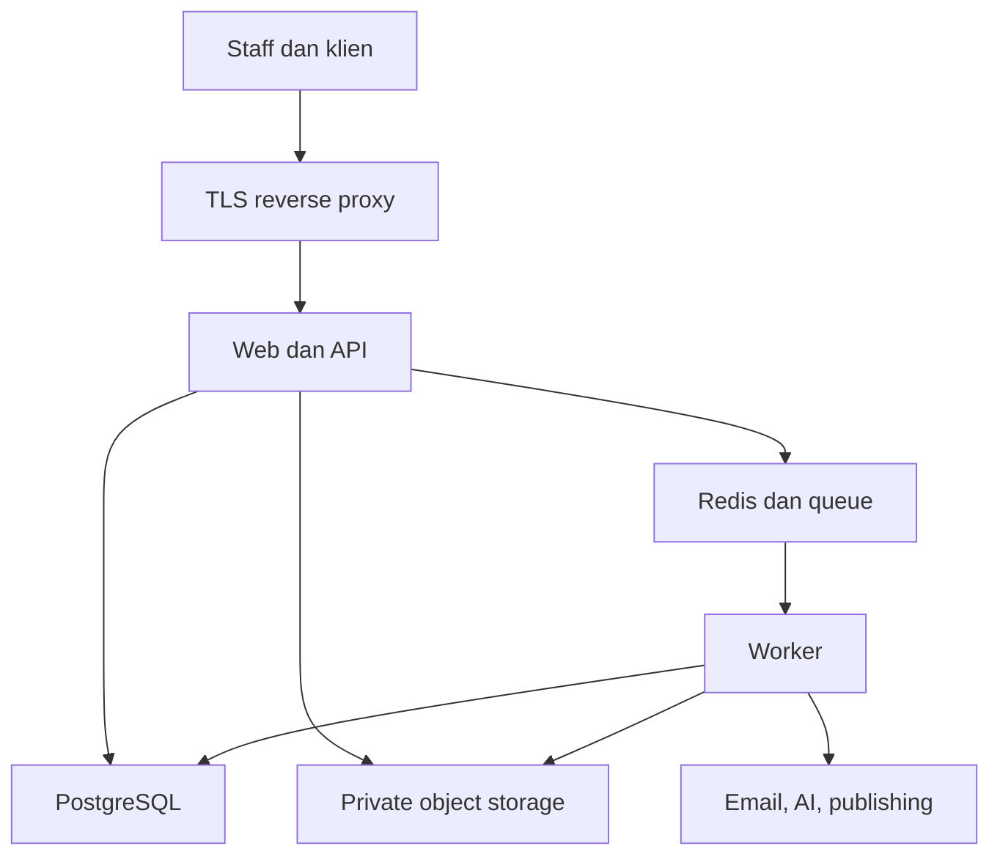
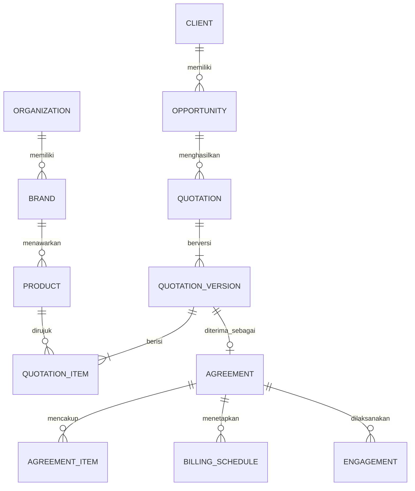
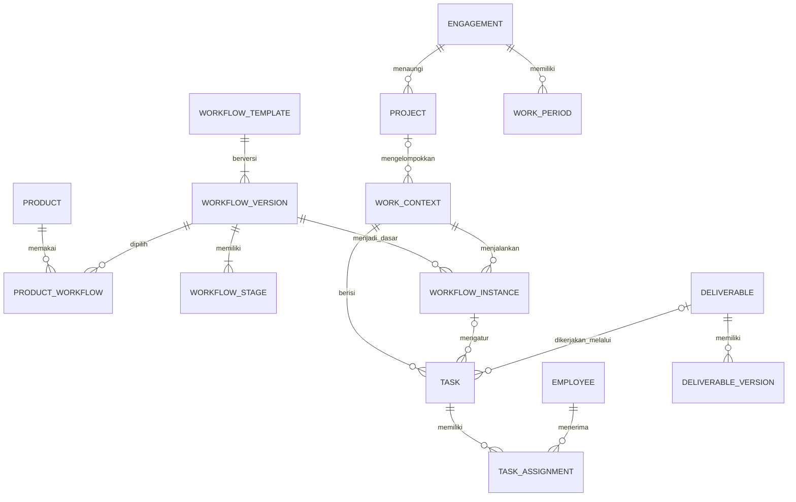
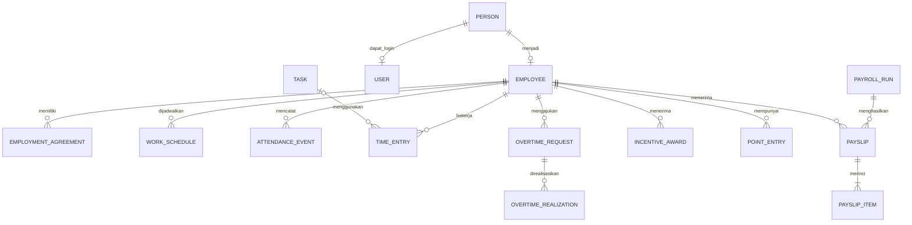
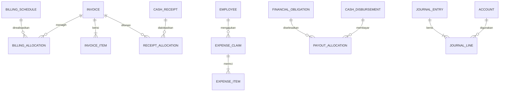

# UDP Integrated Operations Platform — Dokumen Pengembangan

Versi: 2.0 | Tanggal: 30 September 2026 | Status: spesifikasi pengembangan dan perluasan CRM berdasarkan dokumentasi existing.

Dokumen ini menetapkan kebutuhan, alur antar divisi, model entitas, skema logis, keamanan, tech stack, integrasi CRM, dan tahapan pembangunan. Versi 2 menambahkan spesifikasi implementasi pada Bab 22–40 berdasarkan dokumentasi UDP CRM di Pasted text(10).txt: pemetaan 34 model, perubahan business logic, data dictionary field-level untuk entitas kritis, API commands, workflows produk, migration runbook, dan acceptance criteria. Ini tinjauan dokumentasi, bukan audit source code: repository, schema.prisma asli, dan database belum diperiksa. Klaim tentang existing berarti 'menurut dokumentasi yang dilampirkan'. Aturan yang belum dikonfirmasi diberi label OPEN atau PROPOSED, bukan dianggap keputusan perusahaan.

Bab 1–21 menjelaskan kebutuhan lintas domain. Bab 22–40 menetapkan detail implementasi dan mapping ke existing; bila ada perbedaan terminologi/strategi migrasi, detail Bab 22–40 menjadi acuan. Dokumen ini menggantikan versi 1 dalam file yang sama; source documentation CRM tetap dipertahankan tanpa perubahan.

## 1. Tujuan dan ruang lingkup

Satu platform untuk PT Unicam Digital Pictvres (UDP), dengan beberapa brand, produk yang berkembang, serta empat divisi: Marketing, Production, HR, dan Finance. Anak magang umumnya membantu Production. Platform mendukung staf, atasan/koordinator, direktur, administrator teknis, dan klien dengan kewenangan berbeda.

Tujuan operasional:
- Satu pencatatan klien, staf, penawaran, tugas, dan transaksi dengan referensi yang dapat ditelusuri.
- Menghubungkan penjualan, produksi, kehadiran, kompensasi, penagihan, dan biaya.
- Menjalankan workflow berbeda per produk tanpa membuat aplikasi atau tabel status khusus untuk setiap produk.
- Mendukung kontrak berulang, proyek sekali jalan, R&D, dan tugas di luar proyek.
- Mempercepat kerja harian melalui tampilan sesuai peran, notifikasi, template, dan bantuan AI.
- Melindungi data payroll, bank, dokumen sakit, dan informasi internal dari akses yang tidak berwenang.

Lingkup: CRM, katalog produk, penawaran/PKS, pelaksanaan kontrak, proyek/tugas, workflow dinamis, konten/deliverable, review klien, HRIS, dinas, payroll/uang saku, insentif/poin, invoice/pembayaran, pengeluaran, pembukuan bertahap, laporan, dan integrasi.

## 2. Keputusan yang sudah diketahui

| Area | Keputusan pengguna | Implikasi sistem |
|---|---|---|
| Organisasi | Legal seluruh brand atas nama PT UDP | Satu legal entity; laporan konsolidasi UDP, analitik per brand |
| Brand | Memiliki produk dengan flow berbeda | Produk mengacu ke beberapa workflow berversi |
| Digmar | Produk sebuah brand, umumnya kontrak satu tahun | Durasi configurable, periode kerja berulang, termin bebas |
| Dokumen | Penomoran, kop, footer membawa brand | Template dan seri dokumen per brand/jenis/tahun |
| Deliverable | Post/reel/story dan caption dapat direvisi klien | Versioning, feedback, review, dan bukti publish |
| Lead direktur | Tetap melalui penawaran/invoicing | Sumber lead direktur; alur kualifikasi dapat ringkas, dokumen tetap tercatat |
| Rekap HR | Tutup buku tanggal 21 | Tanggal penguncian dan cakupan periode dipisahkan |
| Payroll | Tanggal 25, dimajukan bila bukan hari kerja | Kalender kerja perusahaan menentukan tanggal pencairan |
| Insentif | Custom, dapat berasal dari tugas/dinas/proyek | Aturan berversi, sumber, approval, alokasi biaya |
| UMK | Daerah tujuan menjadi parameter insentif tertentu | Referensi wilayah/tahun, formula kebijakan, snapshot |
| Poin | Cair per kelipatan 10, sisa tersimpan | Ledger, reservasi pencairan, anti pembayaran ganda |
| Magang | Uang saku per hari hadir, dibayar setelah selesai maksimal satu bulan | Akumulasi kewajiban, settlement, tenggat; penerapan perlu tinjauan jenis perjanjian magang |
| Finance | Mengikuti sistem secara bertahap | Aktivasi fitur dan cutover pembukuan per fase |

OPEN: cakupan tanggal rekap tanggal 21 belum ditentukan. PROPOSED: tanggal 22 bulan sebelumnya–21 bulan berjalan bila tanggal 21 termasuk periode; perusahaan harus mengesahkan atau menggantinya.

OPEN: formula insentif berbasis UMK, nilai konversi poin, tarif magang, aturan hari hadir parsial, jam kerja, toleransi terlambat, biaya dinas, serta kewenangan approval belum ditentukan.

### 2.1 Batas aturan lembur dan magang

PP 35/2021 Pasal 26 memuat batas umum 4 jam sehari dan 18 jam seminggu; penghitungan batas itu mengecualikan pekerjaan pada hari istirahat mingguan/libur resmi. Pasal 27–29 mengatur upah, perintah, persetujuan, dan pencatatan lembur. Sistem tidak menganggap semua hari sebagai batas 4 jam yang sama.

Poin merupakan tambahan insentif; tidak dipakai untuk menghapus kewajiban upah atau menyamarkan waktu kerja di atas batas. Sistem memberi peringatan/batas pada rencana penugasan, tetap mencatat realisasi faktual, dan meminta HR meninjau pengecualian. Persetujuan internal tidak otomatis membuat pelampauan batas menjadi sah. Tidak ada hard cap yang menghilangkan menit kerja nyata dari data.

Kebijakan magang setelah selesai adalah kebutuhan perusahaan yang diusulkan. Klasifikasi magang pendidikan/pemagangan ketenagakerjaan, perjanjian, serta kelayakan jadwal pembayaran harus ditinjau sebelum kebijakan diaktifkan. Dokumen ini tidak menyatakan kebijakan tersebut otomatis sesuai semua skema pemagangan.

## 3. Arsitektur dan pilihan tech stack

### 3.1 Keputusan awal

Keputusan desain berdasarkan dokumentasi CRM: pertahankan TypeScript + Next.js App Router + Prisma dan perluas menjadi modular monolith, pindahkan database target ke PostgreSQL, serta tambahkan worker. Existing didokumentasikan memakai Next.js 16.1, Prisma 6.19.2 pinned, SQLite, Bun, Zustand, jsPDF, dan Docker/Coolify. Jangan melakukan upgrade framework/ORM/runtime sekaligus dengan migrasi database. Bun dapat dipertahankan jika integration tests seluruh dependency lulus; Node.js LTS menjadi alternatif hanya bila terdapat blocker runtime yang dibuktikan. Audit source tetap diperlukan sebelum implementasi.

| Pilihan | Kecocokan | Keputusan |
|---|---|---|
| Next.js | Existing CRM sudah menggunakannya | Dipertahankan; tidak rewrite ke framework lain pada fase integrasi |
| TanStack Start | Aplikasi interaktif dengan routing dan server functions bertipe | Tidak dipilih untuk perluasan ini; evaluasi hanya jika ada alasan teknis terukur |
| Strapi | CMS konten dengan admin, Content API, dan model editorial | Opsional untuk artikel/website; bukan fondasi utama payroll/akuntansi |

TanStack Start menyediakan SSR, server functions, server routes, middleware, dan TypeScript. Next.js menyediakan pola data access layer serta pemeriksaan authorization server-side. Strapi RBAC admin tidak identik dengan otorisasi pengguna ERP; dokumentasi transaksi Strapi yang ditinjau masih menandai helper transaksi sebagai experimental. ERP tetap membutuhkan aturan bisnis, transaksi, dan pemeriksaan akses yang khusus. Tidak perlu menggabungkan Next.js dan TanStack Start dalam satu frontend.

Jika CRM sudah menggunakan Laravel/stack lain yang layak, integrasi API dengan backend tersebut merupakan pilihan valid. Jangan mengganti CRM hanya karena teknologi baru sedang populer.

### 3.2 Komponen baseline

| Lapisan | Teknologi/rancangan | Alasan |
|---|---|---|
| Bahasa | TypeScript strict | Kontrak data frontend/backend dan validasi tipe |
| Web | Next.js stable yang masih didukung, patch terbaru setelah audit | UI internal dan client portal |
| UI | React, Tailwind CSS, komponen accessible seperti shadcn/ui | Konsistensi, mobile-first, navigasi keyboard |
| Interaksi | TanStack Query/Table sesuai kebutuhan layar | Cache client, tabel, pagination; tidak menggantikan authorization |
| Form | React Hook Form + Zod | Validasi input client dan server |
| Domain | Modul TypeScript server-only, use cases dan policy services | Aturan terpusat dan mudah diuji |
| Database | PostgreSQL versi yang didukung | FK, constraints, transaksi, concurrency, indeks |
| ORM | Prisma dengan migration SQL untuk constraint khusus | Relasi, transaksi; bukan sumber tunggal integritas |
| Auth | Existing session adapter → server session registry/revocation + MFA; auth library/OIDC dievaluasi terpisah | Hardening segera tanpa memaksa migrasi seluruh password/session bersamaan |
| Queue | Redis + BullMQ | Reminder, dokumen, publish, AI, import/export di worker |
| Storage | Private object storage S3-compatible | Aset/dokumen tidak berada di folder public |
| Realtime | SSE untuk event/notifikasi; Redis sebagai transport antar proses | Satu arah cukup untuk sebagian besar update; WebSocket bila terbukti perlu |
| PDF | jsPDF existing dipertahankan dan diberi immutable snapshot; HTML + Playwright opsional setelah QA | Menjaga desain dokumen yang sudah digunakan; worker untuk generation/send |
| API | REST /api/v1, OpenAPI, signature webhook | Integrasi CRM, publish, aplikasi eksternal |
| Tests | Vitest, integration PostgreSQL, Playwright E2E | Aturan bisnis, transaksi, alur lintas modul |
| Deploy | Docker, reverse proxy TLS, web + worker | Dapat dioperasikan di VPS; staging dan production terpisah |
| Observability | Structured logs, metrics, tracing, error tracking | Audit operasional dan diagnosis |

Versi paket tidak dibekukan di blueprint ini. Pada fase audit pilih kombinasi supported/stable yang kompatibel, pin lockfile dan image, periksa advisories serta lisensi. Auth provider, library AI, dan kanal notifikasi final mengikuti akun/infrastruktur yang tersedia.

### 3.3 Topologi deployment



Database, Redis, dan worker tidak dipublikasikan ke internet. Worker berbagi domain services dengan web. External API tidak dipanggil saat transaksi database masih terbuka; transaksi mencatat outbox, lalu worker mengirim setelah commit.

Modul: identity, organization, crm, catalog, commercial, work, workflow, content, hr, compensation, finance, accounting, documents, integrations, intelligence. Modul lain tidak menulis tabel domain secara langsung; lewat use case yang memiliki aturan dan authorization.

## 4. Model pekerjaan dan workflow dinamis

### 4.1 Hierarki

- Organization: legal entity PT UDP.
- Brand: identitas komersial, seri dokumen, profil kop/footer.
- Product: layanan/paket; Digmar salah satu produk, bukan brand otomatis.
- Agreement: kesepakatan versi komersial yang disahkan.
- Engagement: payung pelaksanaan kesepakatan klien; retainer atau one-time.
- Project: unit kerja produksi, R&D, atau internal; dapat berada dalam engagement.
- Work period: siklus kerja kontrak berulang; frekuensi configurable.
- Work context: jangkar pekerjaan/biaya yang menghubungkan project atau unit operasional.
- Workflow instance: alur nyata yang memakai versi template tertentu.
- Task: unit eksekusi; dapat terkait deliverable dan dapat ditugaskan lintas staf/magang.
- Deliverable: hasil yang dijanjikan, memiliki versi hasil dan review.

Task selalu memiliki work_context_id. Project boleh kosong pada work context operasional; biaya tetap dapat dialokasikan ke brand/divisi. Ini menghindari tugas tanpa kepemilikan dan FK polimorfik yang tidak terjaga.

### 4.2 Template workflow

Satu produk dapat memakai banyak workflow: artikel website, Instagram, atau produksi video. Template berisi tahap, transisi, form wajib, checklist, dependencies, review, aturan assignment, dan otomasi yang diizinkan. Template draft dapat diedit; published version immutable. Perubahan membuat versi baru.

Instance menyimpan template_version_id dan konfigurasi snapshot. Adjustment proyek menghasilkan versi konfigurasi instance dengan diff, alasan, dan approval; tidak mengubah template asal. Migrasi instance berjalan ke versi baru wajib mempunyai stage mapping, pemeriksaan tugas aktif, dry run, dan audit.

Stage mempunyai status_category standar: not_started, active, blocked, review, done, cancelled. Label stage bebas, tetapi laporan lintas produk menggunakan kategori standar tersebut. Transition rules adalah JSON deklaratif dengan operator whitelist, bukan JavaScript/SQL bebas. Validasi graph, reachable stages, terminal states, izin transisi, serta batas otomasi untuk mencegah loop.

Board view hanya representasi: Kanban berdasarkan stage/assignee, table, calendar, timeline, list. Drag card tetap memanggil transition use case dan memeriksa prasyarat server-side. Perubahan view tidak mengubah data tugas.

### 4.3 Template awal

| Workflow | Tahap awal | Hasil dan field khusus |
|---|---|---|
| Artikel website | Brief, riset keyword, seleksi, outline, drafting, aset/embed, review, revisi, jadwal, publish | Keyword, intent, judul, body, media, URL, jadwal, hasil publish |
| Instagram | Brief, pilar, planner, assignment, produksi, caption, review, revisi, schedule, publish | Akun, pillar, format post/reel/story, caption, assets, platform status |
| Software Segia | Brief, requirements, desain, development, QA, UAT, revisi, release, maintenance | Requirement, acceptance criteria, release, issue/bug, target web/desktop |
| Mapping Erfo | Brief, survei, kebutuhan teknis, konsep, task breakdown, produksi, simulasi, uji lokasi, revisi, serah terima | Dimensi, layout, perangkat, resolusi, file produksi, jadwal instalasi |
| R&D | Tujuan, eksperimen, pelaksanaan, evaluasi, dokumentasi, keputusan | Hipotesis, hasil, biaya, keputusan lanjut/henti |
| Operasional | Pengajuan, prioritas, assignment, eksekusi, verifikasi, selesai | Departemen, tujuan, hasil, pusat biaya |

## 5. Alur kerja divisi dan staf

### 5.1 Marketing

1. Input/terima lead, deduplicate klien dan PIC, rekam kanal serta source. Capture otomatis hanya untuk kanal yang benar-benar memiliki connector/API resmi; sisanya input/manual import.
2. Qualify kebutuhan, brand, produk, brief, tanggal target, budget, dan probabilitas. Catat perpindahan komunikasi lintas kanal.
3. Production menilai feasibility, effort, kapasitas, biaya/vendor; Finance atau approver menilai terms/margin.
4. Buat quotation version dengan item produk, lingkup, deliverable, harga, diskon, rush fee jika ada, termin, validity, dan pengecualian.
5. Review internal, kirim, follow-up, negosiasi. Lost wajib alasan; re-offer membuat opportunity baru yang mereferensikan riwayat.
6. Client/director acceptance memiliki evidence. Accepted quotation membuat agreement/engagement dan handover idempotently.
7. Review renewal Digmar dan upsell. Marketing memiliki relasi klien; Production bertanggung jawab eksekusi sesuai lingkup.

Lead direktur dapat melewati aktivitas prospecting yang tidak relevan, tetapi sumber, brief, penawaran, acceptance, agreement, serta invoice tetap dicatat. Dokumen yang dibuat belakangan menyimpan tanggal sebenarnya dan status backfill; tidak memalsukan tanggal penerbitan.

### 5.2 Production

1. Terima handover accepted commercial scope. Tunjuk manager/PIC dan tinjau kebutuhan.
2. Bangun work periods/milestones, budget effort, work contexts, dan workflow instances.
3. Gunakan template/AI untuk draf tasks, checklist, dependencies, due dates, skill dan roles. Manager meninjau sebelum aktivasi.
4. Assign staf/magang berdasarkan availability, schedule, leave, skill, workload. Magang mempunyai supervisor dan reviewer.
5. Staf mengerjakan tugas, memperbarui progres, hasil, blockers, time entries, dan catatan harian.
6. Internal review; kirim deliverable version ke klien bila dibutuhkan. Feedback menghasilkan revisi baru; komentar lama tidak dihapus.
7. Perubahan lingkup menghasilkan change request dan keputusan komersial; hanya change order yang disetujui mengubah budget/terms.
8. Publish/serah terima dicatat dengan bukti dan versi final. Milestone yang memenuhi billing conditions dapat mengusulkan invoice.
9. Tutup proyek setelah handover, dokumen, biaya tertunda, dan settlement diperiksa; closure operasional tidak otomatis berarti invoice lunas.

Digmar dapat langsung menjalankan delivery tanpa approval klien pra-publish jika kontrak mengizinkan; review internal dan feedback/revisi tetap didukung. Jadwal publish tidak sama dengan berhasil publish. Event publikasi menyimpan remote ID/URL, waktu, versi, status, dan error.

### 5.3 HR

1. Kelola staff/intern agreement, reporting line, jadwal efektif, kalender, office/dinas/remote eligibility, dan kebijakan kompensasi.
2. Absensi sesuai expected schedule, bukti lokasi/jaringan, koreksi serta exception.
3. Izin keperluan sesuai H-7 pada SOP; pengajuan mendadak memiliki alasan dan jalur approval atasan. H-7 apakah kalender atau hari kerja adalah OPEN.
4. Laporan sakit diterima HR/atasan; dokumen dokter dibatasi HR. Proses awal laporan dan kelengkapan surat saat kembali tetap dapat dilacak.
5. Lembur: order, consent staf, approval atasan, pelaksanaan, verifikasi, perhitungan. Instansi hari libur/istirahat memakai klasifikasi jadwal staf.
6. Rekap periode tanggal 21, selesaikan anomali lalu lock. Perubahan setelah lock lewat adjustment periode berikutnya atau reopen dengan kewenangan khusus.
7. Serahkan hasil verified ke payroll; staff dapat melihat slip sendiri dan mengajukan keberatan/koreksi.
8. Magang: akumulasi hari hadir dan uang saku, rekap akhir, settlement, due-date tracking, pembayaran dan arsip.

### 5.4 Finance

1. Terima agreement dan billing schedules; siapkan invoice dengan commercial snapshot, brand template, unique number.
2. Review/approval direktur, issue PDF immutable, kirim softcopy; hardcopy/cap/materai bila memang diperlukan tetap menjadi checklist dan evidence.
3. Monitor due dates, reminder ke PIC, receive payment, verify bukti, allocate ke invoice, arsip. Partial payment dan withholding dibedakan.
4. Reimbursement: staf submit rincian/bukti → Finance verify → approval sesuai matrix → disbursement → evidence → accounting posting.
5. Fund request: estimasi → approval → advance/disbursement → actual expense → return/additional reimbursement → reconciliation.
6. Travel: staf dan atasan ajukan destination/dates/team → Finance valuation → director approval → advance → trip → actual receipts maksimal 3 hari kerja setelah selesai menurut SOP → settlement.
7. Payroll: HR verified → Finance calculation/review → authorized approval → payment → payslip/payment evidence → journal.
8. Accounting bertahap: COA, source posting, adjustment, bank reconciliation, period close, financial report review/director approval.

Cashflow, journal, general ledger, piutang dan laporan adalah proyeksi dari transaksi yang sama, bukan empat input manual. Pencatatan journal yang gagal membuat status posting_failed/pending, bukan menandai transaksi sudah selesai di semua laporan.

### 5.5 Direktur, staf, dan klien

Direktur: approve keputusan/biaya sesuai matrix, monitor konsolidasi, kapasitas, margin dan risiko keterlambatan; tidak perlu mengedit setiap task. Staf: tugas, absensi, catatan, pengajuan, slip sendiri. Klien: brief/deliverable/timeline/invoice yang di-share, feedback/acceptance; tidak melihat tugas internal, gaji, effort cost, dan notes privat.

## 6. Absensi, daily log, dan kapasitas

Office check-in: fresh location sample dengan accuracy threshold, radius kantor, server timestamp, nonce anti replay, device/session identity, dan network verification server-side. Browser tidak dapat diasumsikan membaca SSID/BSSID Wi-Fi. Public IP kantor adalah sinyal pendukung, bukan bukti mutlak; IP dinamis, NAT, proxy, serta VPN perlu ditinjau. Pilihan stronger evidence: kiosk kantor atau gateway lokal challenge terbatas. Desain perangkat final mengikuti kemampuan jaringan dan pilihan web/native.

GPS dapat meleset atau dimanipulasi; hasil validasi bukan jaminan 100%. Ketika bukti gagal, simpan percobaan dan exception request yang perlu review, jangan otomatis melabel staf mangkir. Tidak melacak lokasi terus-menerus; ambil saat event relevan, dokumentasikan retention dan hak akses.

Mode kantor, dinas, visit, remote mengikuti work schedule/travel order yang disetujui. Karyawan tidak bebas memilih mode dinas untuk melewati aturan office. Simpan fakta mentah dan keputusan validasi terpisah.

Terlambat dan pulang malam adalah dua fakta. Jam tambahan tidak otomatis menghapus keterlambatan atau menghasilkan pembayaran. Realized work, rest intervals, approved overtime, dan schedule menentukan hasil; otorisasi pembayaran bukan alasan menghapus waktu nyata.

Daily report otomatis menampilkan tasks yang diperbarui, hasil, kendala, next steps, dan timesheet jika required. Check-out tetap dapat disimpan bila report belum lengkap; outstanding report memperoleh due date/reminder. Offline check-in disimpan sebagai submission menunggu verifikasi dengan claimed time dan received time; tidak langsung dianggap valid office attendance.

Capacity menggunakan schedule, leave, assignments, estimated effort, dan availability. Attendance saja tidak membuktikan produktivitas. Timesheet tidak boleh otomatis disalin seluruhnya dari jam hadir.

## 7. Kompensasi, poin, dan pembebanan

Komponen berbeda: base salary, attendance allowance, overtime payable, task/project incentive, travel allowance, expense reimbursement, reward points redemption, internship allowance. Reimbursement bukan otomatis komponen upah; perlakuan akuntansi/pajak ditetapkan Finance sesuai kebijakan yang ditinjau.

UMK/UMP reference: region, year/effective range, source official, value. Rule menyatakan kapan UMK tujuan dipakai, fallback UMP bila relevan pada rule, formula dan plafon. Nilai disnapshot saat incentive approved. Tidak memakai UMK tujuan otomatis sebagai rumus upah lembur.

Points ledger: earn, adjustment, reserve, redeem, release, reversal. Reserve bukan pembayaran; redeemed baru saat settlement. Atomic transaction dan lock menjaga saldo. Saldo 27 → request 20 → reserve 20 → approved/paid redeem 20 → tersedia 7. Reject/failure melepaskan reservation. Unit redemption 10 dan conversion value berversi; sisa tidak expired kecuali perusahaan secara eksplisit menetapkan aturan lain.

Rush fee adalah sales invoice line. Overtime/incentive adalah cost obligation. Funding source dan cost allocation berbeda dari right-to-payment; unpaid invoice klien tidak menghapus kewajiban staf. Menautkan rush fee dengan alokasi incentive hanya untuk budget/profitability, bukan otomatis 1:1.

Payroll period berisi start/end, cutoff/lock, planned pay date, adjusted pay date, status. Proposed date-25 adjustment: cari hari kerja perusahaan terakhir pada/sebelum 25. Payment date bukan janji transfer otomatis; verifikasi bank/payment evidence tetap diperlukan.

Payroll finalized menyimpan snapshots aturan dan inputs. Koreksi tidak menimpa payslip historical. Payout rekening diperiksa server-side dengan approval tambahan bila berubah menjelang pembayaran.

Cost allocation terdiri dari amount dan cost center/work context. Total allocations harus sama dengan source amount yang dialokasikan. Labour managerial costing dari timesheet dipisahkan dari journal aktual agar gaji yang sudah dibukukan tidak dihitung dua kali. Nilai kontrak, nilai invoice, pembayaran masuk, dan pendapatan diakui adalah ukuran berbeda.

## 8. ERD konseptual per domain

### 8.1 Komersial



### 8.2 Pekerjaan dan workflow



### 8.3 SDM dan kompensasi



### 8.4 Finance



ERD menunjukkan relasi utama, bukan semua tabel. Periode, review, approvals, source links, taxes, dan audit dijelaskan dalam kamus berikut. Cardinality billing allocation mengizinkan splitting/combine termin yang disetujui, dengan kontrol nominal agar tidak double billing.

## 9. Kamus data logis

### 9.1 Konvensi fisik

- PK target memakai UUID untuk tabel baru; ID tabel existing dipertahankan sebagai text bila source menggunakan CUID/string lain. FK eksplisit dengan tipe yang sama. Tidak melakukan re-key seluruh CRM tanpa alasan. business number bukan PK.
- Tabel domain memiliki organization_id; tenant isolation enforced walau saat ini satu legal entity.
- timestamps timestamptz UTC, display Asia/Jakarta; business dates date.
- amount numeric(20,2), rate numeric(12,6), currency char(3); minutes integer nonnegative; no floating point money.
- created_by, created_at, updated_at dan revision untuk optimistic concurrency pada tabel editable.
- master boleh deactivate/soft-delete; ledger/issued documents append-only, reversal untuk koreksi.
- JSONB hanya spesifikasi/form/snapshot konfigurasi; money, FKs, dates, status utama tetap relational.
- Enum/status code standar dipisah dari label stage configurable.
- Snapshot penerbit/klien/alamat/rekening/terms/template disimpan saat dokumen issued, bukan dibaca ulang dari master yang berubah.

### 9.2 Identity, organisasi, akses

| Tabel | Field utama selain PK |
|---|---|
| organizations | legal_name, legal_address, tax_profile_id, timezone |
| brands | organization_id, code UNIQUE per organisasi, name, active |
| departments | organization_id, code, name |
| persons | organization_id, display_name, contact fields; PII dibatasi |
| users | person_id UNIQUE, identity_provider_id, verified_email, status |
| roles / permissions | code UNIQUE, action definitions |
| role_grants | user_id, role_id, scope_kind, organization_id, brand_id?, department_id?; CHECK scope |
| employees | person_id UNIQUE, employee_number, status |
| employment_agreements | employee_id, type, starts_on, ends_on?, policy_version_id |
| department_assignments | employee_id, department_id, valid_from/to |
| reporting_lines | employee_id, supervisor_id, valid_from/to |
| internships | employee_id, agreement_id, school/program, supervisor_id, planned/actual_end, stipend_policy_id |
| employee_bank_accounts | employee_id, protected account data, verified_at, approval_id |

External client users memakai client_access_grants, tidak dibuat sebagai employee. Login email domain udp.co.id berdasarkan verified identity + invitation/approved membership, bukan suffix string saja.

### 9.3 CRM dan commercial

| Tabel | Field utama |
|---|---|
| clients | legal_name, billing details, dedupe keys, status |
| client_contacts | client_id, name, role, email, phone, active |
| leads | source_code, channel, contact/client?, owner_user_id, status |
| opportunities | lead_id?, client_id, brand_id, owner, stage, lost_reason?, director_source |
| communication_events | opportunity_id?, contact_id, channel, time, direction, summary, external_message_id? |
| followups | opportunity_id, assignee, due_at, sequence, template_version_id?, outcome |
| products | brand_id, code, name, active, allowed_engagement_modes |
| product_versions | product_id, version, specification_schema, deliverable_defaults |
| product_price_versions | product_version_id, currency, pricing_unit, amount, effective dates |
| briefs / brief_versions | client/project context, version, validated specification, approval |
| quotations | opportunity_id, brand_id, logical reference |
| quotation_versions | quotation_id, version_no, status, currency, totals, scope snapshot, sent/accepted_at |
| quotation_items | quotation_version_id, product_version_id?, description_snapshot, qty, unit, unit_price, discounts |
| quotation_terms | quotation_version_id, billing/validity/revision/acceptance terms |
| agreements | client_id, brand_id, accepted_quotation_version_id UNIQUE?, starts_on, ends_on, status |
| agreement_items | agreement_id, quotation_item_id?, product_version_id, scope snapshot |
| change_orders | agreement_id, source_request, commercial deltas, approved version/evidence |
| billing_schedules | agreement_id, currency, amount, condition_kind, planned_date?, milestone_id?, due_rule |
| engagements | agreement_id, mode retainer/one_time, start/end, delivery_owner |

Handover create command mempunyai unique idempotency key terhadap accepted quotation/version. Renewal membuat agreement baru dengan previous_agreement_id, menjaga histori kontrak lama.

### 9.4 Work dan workflow

| Tabel | Field utama |
|---|---|
| projects | engagement_id?, brand_id, origin client/rnd/internal, manager_id, planned/actual dates, status |
| work_periods | engagement_id, start/end, sequence, status; unique engagement+sequence |
| cost_centers | organization_id, brand_id?, department_id?, code |
| work_contexts | project_id?, cost_center_id, brand_id, department_id?, name, kind |
| project_members | project_id, employee_id, project_role, effective dates |
| milestones | project_id, name, acceptance criteria, planned/completed_at |
| workflow_templates | code, name, owner, target_scope |
| workflow_versions | template_id, version_no, state draft/published/retired, definition_hash |
| workflow_stages | workflow_version_id, stage_key, category, label, ordering; unique version+key |
| workflow_transitions | workflow_version_id, from/to_stage_id, roles, guard_schema, action_definitions |
| task_templates | workflow_version_id, stage_id?, title, checklist, effort, skill/role, dependency specs |
| product_workflows | product_version_id, workflow_version_id, applicability, default_view |
| workflow_instances | work_context_id, work_period_id?, workflow_version_id, configuration_revision |
| workflow_instance_revisions | instance_id, version, effective config, diff, reason, approval |
| tasks | work_context_id, workflow_instance_id?, stage_id?, deliverable_id?, title, priority, due_at, estimate_minutes, revision |
| task_assignments | task_id, employee_id, role, assigned_by; unique task+employee+role |
| task_dependencies | predecessor_id, successor_id, relation_type; no self edge/cycle |
| task_events / comments | task_id, actor, old/new stage, notes, visibility |
| board_views | owner/scope, view_type, filters, group_by, columns, visibility |
| time_entries | employee_id, work_context_id, task_id?, start/end or minutes, status, approver |
| daily_reports | employee_id, business_date, summary, blockers, next_steps, status |
| daily_report_items | report_id, task/time_entry reference, summary |

Tasks dengan stage_id harus merujuk stage pada workflow_version yang sesuai instance. Constraints SQL atau server validation+integration test enforce cross-table invariants. Arbitrary instance stages harus dibuat dalam konfigurasi versi instance dengan referensi yang valid, bukan string bebas di task.

### 9.5 Content dan deliverable

| Tabel | Field utama |
|---|---|
| client_channels | client_id, platform, account/site identifier, integration_connection_id? |
| content_pillars | engagement_id, title, objective, audience |
| content_plans | work_period_id, channel_id, status, planning notes |
| keyword_research_sets | engagement_id, created_by, source |
| keywords | research_set_id, phrase, intent, metrics provenance, selected |
| deliverables | agreement_item_id?, work_context_id, work_period_id?, plan_id?, keyword_id?, format, title, target_date |
| deliverable_versions | deliverable_id, version_no, body/caption, specification_json, immutable after review/issue |
| deliverable_asset_links | version_id, document_id, asset_role, order |
| review_rounds | version_id, reviewer_type, deadline, status |
| client_feedback | round_id, client_user_id, comment, annotations, resolution |
| review_decisions | round_id, decision, actor, evidence |
| publication_schedules | version_id, channel_id, publish_at, state, dedupe_key |
| publication_events | schedule_id, remote_id/url, occurred_at, state, provider_error |
| software_requirements | project_id, identifier, description, acceptance_criteria, status |
| software_releases / issues | project_id, version, target, requirement/task references |
| mapping_specs | project_id, approved_version, dimensions, equipment/layout references |

Instagram permissions/API constraints diverge by account/provider. Manual publish confirmation adalah fallback yang eksplisit. Tidak menjanjikan semua format/account dapat dipublish otomatis.

### 9.6 HR dan compensation

| Tabel | Field utama |
|---|---|
| work_calendars / calendar_days | calendar_id, date, day_kind, source, override approval |
| work_locations | office/site, coordinates, radius, accuracy_threshold, network policy |
| work_schedules | employee_id, valid date/range, start/end, break_rule, mode, location_id?, travel_order_id? |
| attendance_events | employee_id, event_type, claimed/received_at, source, location sample, network verdict, validation_status |
| attendance_sessions | employee_id, schedule_id, checkin/checkout_event_id, derived minutes, review_status |
| attendance_adjustments | session/event reference, before/after, reason, approval_id |
| leave_requests / sick_reports | employee_id, type, date range, reason, evidence_id?, status |
| overtime_orders | issuer, date/range, purpose, work_context_id?, approval policy |
| overtime_requests | order_id, employee_id, planned start/end, consent_at, status |
| overtime_realizations | request_id, factual intervals, rest, verified_minutes, day_kind, review |
| policy_versions | policy_type, effective dates, declared formula inputs/rules, approved_by |
| regional_wage_references | region_code, year, effective dates, type UMK/UMP, amount, official_source |
| incentive_awards | employee_id, work_context_id?, source work/travel, policy_version_id, parameter_snapshot, amount, approval |
| point_entries | employee_id, entry_kind, points_delta, source award/redemption, reversal_of?, posted_at |
| point_redemptions | employee_id, requested_points multiple of 10, conversion_snapshot, state, reserved/settled_at |
| payroll_periods | starts_on, ends_on, cutoff_at, planned/adjusted_payment_date, status |
| payroll_runs | period_id, revision, state, calculation_hash, approved_by |
| payslips | run_id, employee_id, agreement snapshot, gross/deductions/net; unique run+employee |
| payslip_items | payslip_id, component, amount, policy snapshot, source reference |
| internship_accruals | internship_id, date, verified attendance reference, rate snapshot, amount; unique internship+date |
| internship_settlements | internship_id, through_date, accrued/adjusted/payable, due_on, state |

Referensi sumber payroll/awards diwujudkan melalui tabel penghubung bertipe (overtime, incentive, redemption, dan seterusnya) atau registry bisnis dengan FK nyata; bukan pasangan type/id bebas tanpa integritas. Nama kode menggunakan bahasa Inggris; UI menggunakan bahasa Indonesia.

### 9.7 Finance dan akuntansi

| Tabel | Field utama |
|---|---|
| document_number_series | brand_id, document_type, fiscal_year, prefix/pattern, counter; unique scope |
| document_template_versions | brand_id, kind, version, header/footer, legal fields, approved |
| invoices | client_id, brand_id, issued_number UNIQUE per organization, currency, state, issue/due dates, frozen snapshot |
| invoice_items | invoice_id, agreement_item_id?, description, qty, price, discount, tax_rule snapshot |
| billing_allocations | schedule_id, invoice_item_id, amount; aggregate cap against agreed schedule |
| invoice_adjustments | invoice_id, kind/tax/withholding/credit, basis, amount, evidence |
| cash_receipts | received_date, bank/cash_account_id, amount, currency, payer, evidence, verification |
| receipt_allocations | receipt_id, invoice_id, amount; prevent over allocation |
| withholding_certificates | client_id, invoice_id?, reference, amount, document_id, verification |
| fund_requests | requester, work_context_id?, category, amount, needed_on, approval |
| expense_claims / expense_items | employee_id, dates, purpose, category, amount, receipt evidence, verified |
| travel_orders / travel_members | purpose, work_context_id?, destinations/dates, responsible employee, approvals |
| travel_budget_items | travel_order_id, transport/accommodation/meal/allowance/incentive, valuation snapshot |
| travel_advances | travel_order_id, amount, disbursement allocation, state |
| travel_settlements / settlement_items | advance reference, actual receipts, amount returned/additional_due, verified |
| financial_obligations | creditor employee/vendor, currency, amount, state, source_kind |
| obligation_source_links | typed payslip/claim/settlement/incentive FKs; exactly one source per obligation |
| cash_disbursements | bank/cash_account_id, amount, currency, payee, paid_at, transfer reference/evidence |
| payout_allocations | obligation_id, disbursement_id, amount |
| cost_allocations | source cost obligation/item, work_context/cost_center, amount, basis |
| accounts | organization_id, code, name, account_type, active |
| posting_events | typed source_id links, posting_version, state, unique source+version |
| journal_entries | posting_event_id?, date, accounting_period_id, status, reversal_of? |
| journal_lines | entry_id, account_id, debit, credit, brand/cost center dimensions |
| accounting_periods | start/end, status, closed_by/at |
| bank_transactions / reconciliations | import reference, posted_date, amount, matched receipt/disbursement |
| fixed_assets / depreciation_events | optional fase lanjut, source expense, cost/useful life/method |

Dengan satu legal entity, saldo bank/kas tidak diduplikasi per brand. Dimensi brand dipakai untuk analisis; tidak menciptakan uang terpisah. Saldo klien/vendor, statements, dan laporan keuangan diturunkan dari transaksi sumber.

### 9.8 Kendali, AI, dan integrasi

| Tabel | Field utama |
|---|---|
| business_records | organization_id, kind; typed domain tables memiliki unique FK ke registry bila generic linking diperlukan |
| documents | private storage_key, mime, checksum, size, classification, uploader |
| record_document_links | business_record_id, document_id, purpose |
| approval_policy_versions | domain/action, thresholds, steps, scoped approver roles |
| approval_requests / approval_steps | business_record_id, policy_version_id, frozen input hash, step status, actor, decision |
| audit_events | actor, action, resource, diff redacted, timestamp, reason |
| integration_connections | provider, owner scope, secret reference, scopes, status |
| external_id_maps | source_system, entity_kind, external_id, internal business_record_id; unique source+kind+external_id |
| webhook_inbox | provider/event_id UNIQUE, received_at, signature verdict, processing status |
| outbox_events | event type, resource_id, payload minimum, committed_at, dispatch status |
| notifications / notification_deliveries | recipient, event_id, channel, status, read_at, retry |
| import_jobs / import_rows | uploader, mapping_version, row_key, validation errors, dry-run/applied |
| ai_plan_drafts | work_context_id, brief_version_id, workflow_version_id?, provider/model, schema version, draft, reviewed_by |
| ai_execution_logs | input hash/minimized references, output, token/cost, actor, safety/validation result |

business_records hanya dipakai bila generic cross-module linking benar-benar perlu; tiap domain row memiliki FK registry dan unique link. Jangan membuat duplikasi master atau menjadikan registry pengganti semua FK domain.

## 10. State machines dan transaksi penting

| Objek | State utama |
|---|---|
| Quotation version | draft → internal_review → approved_to_send → sent → accepted/rejected/expired/superseded |
| Agreement | draft → approved → active → suspended/ended/cancelled |
| Task | configurable stages; category standard tetap berlaku |
| Review round | pending → reviewed → approved/changes_requested |
| Publication | draft → queued → publishing → published/failed/cancelled |
| HR request | draft → submitted → reviewing → approved/rejected → realized/closed |
| Payroll | draft → calculated → reviewed → approved → finalized → partly_paid/paid |
| Invoice | draft → approved → issued → partly_settled/settled; overdue derived |
| Points redemption | submitted → reserved → approved → settled; rejected/cancelled release reservation |
| Travel settlement | pending_receipts → submitted → verified → additional_due/return_due/balanced → settled |

Transitions divalidasi pada server dan dicatat. Status overdue derived dari due date dan outstanding, bukan event payment manual yang saling bertabrakan.

Transaksi atomik wajib:
- Accept quote + create agreement/engagement + outbox; unique source acceptance.
- Invoice issue + reserve/increment number + freeze snapshot + billing allocation + outbox.
- Payment allocation + balance checks + accounting event.
- Points reserve/redeem + available balance checks + obligation creation.
- Payroll finalize + source snapshots + obligations + posting events.
- Journal post: valid source, period open, total debit = total credit, all lines one currency basis.

Unique constraints/idempotency keys mencegah double submits. Gunakan row locks atau serializable isolation pada balance/counter critical dengan bounded retries. Tidak mengandalkan Redis lock sebagai satu-satunya penjaga uang. Number yang sudah issued tidak dipakai ulang; draft dapat belum mendapat nomor legal.

## 11. Hak akses dan approval

| Role | Akses utama | Batas |
|---|---|---|
| Technical admin | Setup, deployment, membership sesuai mandat | Tidak otomatis dapat membaca payroll melalui UI |
| Direktur | Consolidated oversight, approvals, pricing exceptions | Persetujuan tercatat, tidak menghapus audit |
| Marketing | Lead/client, quote, client-facing progress/invoice sesuai scope | Tidak melihat slip/gaji/dokumen sakit |
| Production manager | Brief, project, assignment, review, effort, cost summary authorized | Tidak melihat employee private salary breakdown |
| Production staff | Assigned tasks, shared assets, own attendance/time/report | Tidak seluruh proyek secara default |
| Magang | Assigned work, own attendance/allowance, supervisor | Tidak approve pengajuan sendiri atau work final tanpa mandat |
| HR | Employee/schedule, attendance/leave, payroll preparation | Dokumen medis tidak disebar ke tim produksi |
| Finance | Invoice, verified payroll payable, expenses, bank, journals | Detail medis tidak diperlukan |
| Client | Shared records milik client_id yang diberikan akses | Tidak internal notes, labor cost, payroll, data klien lain |

RBAC + scopes brand/divisi/project/client + relationship rules (own, supervisor, member). Check read dan write di semua API/actions, export, file URL, realtime subscription, AI retrieval. Menyembunyikan tombol bukan authorization.

Approval configurable by domain, nominal, brand, department. Bedakan acknowledged, verified, approved, paid. Default separation requester/approver/payer; directorship override perlu alasan dan audit. Step yang sudah approve invalidated bila input material berubah; input hash mencegah approval atas data lama dipakai untuk nilai baru.

## 12. AI assistant dan otomasi

AI membantu brief completeness, workflow draft, task breakdown, estimates, risks, checklist, konten draft, dan reuse template. Tidak membuat final legal/financial decisions. Output typed JSON sesuai schema, validated, diffable, dan review manual sebelum activate.

Input hanya data proyek yang actor boleh lihat; payroll/bank/medical tidak masuk AI planning. Dokumen klien treated as untrusted instructions; tidak boleh mengubah system rules/tools. Tools allowlist read/search/draft, tanpa arbitrary SQL/shell. Provider/model configurable, timeout, budget cap, redact PII, per-request audit. Model tidak diberi token publish/payout.

Template recommendation mencantumkan sumber versi, asumsi, unconfirmed items. Reuse bukan copy approval klien lama atau confidential content klien lain. AI tidak otomatis assign berdasarkan dugaan skill; manager memvalidasi availability dan deadline.

Automation idempotent, memiliki owner, retry limit, failure log, replay tools. Event workflow hanya mengusulkan invoice/bonus bila rule terpenuhi; approval rules tetap berlaku.

## 13. UX, real time, dan laporan

Mobile-first: Today page berisi jadwal/lokasi, check-in/out, task prioritized, approval inbox, daily report. Desktop: table/board/timeline, search/filter saved views. Client portal sederhana: brief, deliverable versions, feedback, timeline publik, invoice.

Default per role; tidak menampilkan semua informasi ke semua orang. Nama klien/proyek tidak terpotong tanpa cara membaca lengkap. Bottom sheet mobile dengan sticky actions; desktop dialog. Tooltip untuk petunjuk sekunder; validasi dan error tindakan tetap terlihat. Drag/drop punya alternatif menu untuk accessibility.

Realtime notification: assignment, mention, due-date change, blocked, review request, rejected request. Update minor dirangkum. Notifikasi persisten di DB, realtime delivery hanya accelerator; reconnect replay event ID tanpa duplikasi. No sensitive payload pada push lockscreen. Presence online tidak menjadi data absensi.

Laporan: pipeline conversion/source/brand, renewal, outstanding scope, deliverable due/publish, workload, timesheet approved, attendance anomaly, overtime by category, payroll payable, point liability, stipend outstanding, receivable aging, advances unsettled, project actual/budget margin, consolidated financials. Label revenue recognition vs invoice vs cash dengan jelas.

## 14. Integrasi API dan publishing

Contoh commands:
- POST /api/v1/quotations/{id}/versions; POST /versions/{id}/accept.
- POST /api/v1/workflows/{id}/publish; POST /workflow-instances; POST /tasks/{id}/transition.
- POST /api/v1/deliverables/{id}/versions; POST /reviews/{id}/decision.
- POST /api/v1/attendance/events; POST /attendance-adjustments.
- POST /api/v1/overtime-requests; POST /overtime-realizations.
- POST /api/v1/payroll-runs/{id}/finalize; POST /point-redemptions.
- POST /api/v1/invoices/{id}/issue; POST /cash-receipts/{id}/allocate.
- POST /api/v1/travel-orders/{id}/settle; POST /api/v1/webhooks/{provider}.

Typed input, server policy checks, idempotency key untuk critical writes, revision If-Match untuk edits, pagination, scoped search. Standard error includes code, message, field errors, correlation ID tanpa stack/secrets. Jangan expose generic status update endpoint yang bypass domain transition.

CMS/publish adapters mendukung manual, existing CMS API, WordPress/Strapi bila tersedia. ERP adalah sumber planning/review; CMS tujuan adalah sumber remote publication state. Artikel dibuat draft di remote lalu published sesuai approved schedule/version, diverifikasi melalui provider event/query. Remote ID map dan retry mencegah artikel ganda. Integrasi Instagram bergantung account/permission/provider; webhook signed, inbox dedupe, secrets encrypted.

## 15. Keamanan, performa, dan operasional

Keamanan: MFA peran HR/Finance/director/admin; secure HttpOnly cookies, session rotation/revocation, CSRF/origin checks, rate limits, verified email/invite, least privilege, TLS, CSP, output sanitization, file type/size/scanning, signed short-lived file URLs setelah ACL check. Embedded video allowlist; fetch URL server-side memakai SSRF protection. Redact secrets, bank details, salary, medical information dari logs/errors dan AI inputs.

Identity admin teknis berbeda dengan data payroll access. Akses DB operator tetap memiliki risiko privileged access dan harus dikontrol lewat limited credentials/audit, bukan mengklaim role UI menghapusnya. Client isolation diuji dengan guessed IDs, search, files, exports, dan realtime.

Backups: encrypted PostgreSQL backup + WAL/PITR bila didukung infrastruktur, object storage versioning/backup, restore drill ke isolated environment. Target awal PROPOSED RPO ≤ 1 jam, RTO ≤ 4 jam; hanya dinyatakan tercapai setelah drill. Backup disimpan di luar mesin utama. Retention per jenis data ditetapkan HR/Finance/legal, bukan angka default tanpa review.

Performa target PROPOSED untuk dataset/load yang disepakati: p95 read API <500 ms, normal writes <1 s excluding external APIs; event notification online <3 s. Heavy imports/PDF/AI/report di worker. Index organization/status/due date, project/employee links, invoice due/outstanding, event timestamps. Cursor pagination, virtualized large board/table, avoid N+1, immutable media cached authorized. Jangan share-cache private responses antar user.

Sebelum sizing server: ketahui active staff, concurrent users, daily tasks, assets size, publish jobs, retention. Modular monolith tidak berarti web/worker/database harus berada pada satu mesin. Awal boleh satu VPS dengan layanan terisolasi dan offsite backup; scale database/worker/web setelah measurement.

CI: typecheck/lint, unit/integration/E2E essentials, dependency/secrets scan, build, migration rehearsal on sanitized DB. Deploy expand-contract migrations; rollback app hanya bila schema backward compatible. Destructive migration terpisah setelah cutover verified. Environment dev/staging/production memiliki secrets dan databases berbeda. Jangan menjalankan migration reset pada production.

## 16. Integrasi CRM existing

### 16.1 Data yang diperlukan

Minimum untuk mulai audit: source/repo snapshot tanpa secrets, package manifests/lockfiles, DB schema+migrations, alur/screenshots CRM, daftar roles, dan daftar integrasi.

| Kelompok | Bahan yang dibutuhkan | Tujuan |
|---|---|---|
| Code | Repo read-only atau ZIP, branch/commit, README, package.json/composer.json, lockfile, directory overview | Menilai reuse modul dan compatibility |
| Schema | Prisma schema/SQL DDL/model Laravel, migrations, ERD jika ada | Mapping clients/leads/quotes/users/brands |
| Sample data | Synthetic/anonymized representative rows, ID format, nulls, duplicates | Menilai kualitas dan constraints; bukan production dump mentah |
| Features | Lead pipeline, follow-up, quote/versioning, client portal, reports; screenshots/video | Memetakan existing vs missing |
| Auth | Provider, session model, roles/permissions, invite/login/domain rules | Shared identity dan access boundaries |
| API | OpenAPI/Postman, route list, webhooks, signatures, pagination/rate limits | Memilih integration path |
| Integrations | Email/WA/IG/forms, storage, payments, AI; source ownership | Mencegah duplicate capture dan insecure tokens |
| Infra | Hosting, runtime/DB versions, Docker/config redacted, CI, worker/scheduler, backup | Deployment dan migration safety |
| Usage | Count users/records/concurrency/assets, masalah/performa yang diketahui | Sizing dan priorities |
| Commercial data | Quote statuses, numbering, calculation/tax logic, accepted terms | Menjaga histori komersial |
| Tests/history | Existing tests, known bugs, active roadmap | Menjaga behavior yang sudah dipakai |

Jangan kirim .env aktif, private keys, passwords, access tokens, bank credentials, atau seluruh data pasien/pegawai/klien nyata. Berikan .env.example dengan nama variabel dan nilai contoh; akses audit staging memakai akun terbatas bila diperlukan. Schema dan sample anonim cukup untuk keputusan awal.

### 16.2 Pilihan integrasi

A. Extend in place: CRM compatible/maintainable → pertahankan identity/client/lead/opportunity; tambah domain ERP lewat services dan migrasi.

B. Coexist lewat API: CRM beda stack atau masih perlu berjalan mandiri → CRM menjadi writer utama domain lead/opportunity sementara; ERP writer domain project/HR/finance. Sync selected fields, external IDs, version/order handling, outbox/inbox, reconciliation. SSO bila memungkinkan. Satu owner per field/domain; hindari dual writes dan sync dua arah tanpa aturan conflict.

C. Gradual replacement: bagian CRM bermasalah → migrasi domain demi domain, bukan rewrite sekaligus. Browser UI masih satu navigation/identity meskipun sementara backends berbeda.

### 16.3 Audit output dan migration

Hasil audit: diagram as-is, mapping keep/refactor/replace/new, source ownership, auth gaps, financial calculation gaps, schema mapping, rollout cost/risk, final ADR stack.

Migrasi: inventory → backup → anonymized rehearsal → mapping/dedupe → external ID links → staged load → counts/value checks → user acceptance → temporary write restriction/cutover → reconciliation → monitor. Preserve original numbers/dates/status and source evidence. Historical quote yang belum berversi diberi imported legacy version, bukan direkonstruksi sebagai persetujuan yang tidak terbukti.

Opening balances dan receivables/advances/payroll liabilities ditetapkan Finance pada tanggal cutover; jangan import cashflow dan journals yang sama sebagai dua transaksi. Rollback/cutover stop criteria: record counts, outstanding balances, duplicate invoices, access leak, inconsistent payroll.

## 17. Roadmap bertahap dan acceptance gates

| Fase | Deliverables | Gate sebelum lanjut |
|---|---|---|
| 0 Audit | CRM inventory, schema mapping, final stack ADR, SOP decisions | Owner bisnis menyetujui unresolved policies dan domain ownership |
| 1 Foundation | Identity, roles/scopes, brand/product, document storage/audit | Tests isolation, file ACL, invite/MFA, backup restore |
| 2 Commercial | CRM extension, quotes/version, agreement, terms, invoice/receipts dasar | Lead direktur dan regular sama-sama traceable; no double issue/allocations |
| 3 Work | Dynamic templates, project/period, tasks, review, workflow boards | Retainer dan one-time, R&D dan standalone task berjalan |
| 4 Content/AI | Keyword/planner, deliverable revisions, publication adapter, AI drafts | No wrong version publish; human review; external retry dedupe |
| 5 HR | Schedules/geofence/exceptions, leave/sick/overtime, daily reports | Office/dinas/holiday cases dan cutoff validated |
| 6 Compensation | Payroll, incentives/points, magang accrual/settlement | Parallel calculation vs HR reference; no double payout |
| 7 Finance depth | Expense/dinas settlement, journals, bank reconciliation, closing | Balanced ledger, advance reconciliation, approved reports |
| 8 Optimization | Portals, analytics, load improvements, additional products | Measure performance, user adoption, operational runbooks |

Nomor fase menyatakan dependencies, bukan durasi pasti. HR discovery dapat berjalan bersamaan dengan desain Commercial; production release tetap mengikuti gates. Estimasi waktu baru dibuat setelah audit CRM, team size, dan volume data diketahui.

## 18. Skenario uji wajib

1. Brand berbeda memiliki document series/kop berbeda dengan satu PT legal; concurrent issue tidak membuat nomor ganda.
2. Lead direktur membuat quote/agreement/project/invoice tanpa duplicate clients atau acceptance.
3. Digmar 12 bulan dengan termin bebas; beberapa workflows dan work periods, perubahan paket terdokumentasi.
4. Post/reel/article revisi memiliki version history; scheduler hanya memakai versi approved yang tepat, retry tidak publish ganda.
5. Template versi baru tidak mengubah instances lama; adjustment instance memiliki audit dan stage mapping valid.
6. R&D dan standalone ops tasks tetap memiliki cost center, assignee, dan report tanpa invoice wajib.
7. Magang dapat menerima task tetapi tidak approve hasil/payout sendiri.
8. Employee terlambat lalu pulang malam: status keterlambatan, factual work, dan approved overtime tetap terpisah.
9. Dinas berbeda metode absensi, allowance, advance dan actual; receipts deadline 3 workdays dan settlement balance benar.
10. Weekend biasa vs scheduled rest day/libur resmi memakai kategori yang benar; lembur lintas midnight dipisah per date/day classification.
11. GPS kurang akurat/Wi-Fi gagal menghasilkan exception; forged GPS/client clock/replay tidak otomatis diterima.
12. HR cutoff 21 lock; holiday tanggal 25 memajukan payment date; adjustment tidak menimpa slip issued.
13. Poin 27, dua pencairan concurrent 20: hanya satu boleh reserve; rejected request releases saldo; settle retry tidak double pay.
14. Magang rate berubah tengah periode: accrual memakai effective rate per hari, final settlement tanpa hari ganda.
15. Partial payment, withholding certificate, credit correction dan multiple invoices membuat outstanding benar, tidak memaksa cocok hanya cash.
16. Ledger debit/credit balance, period closed menolak posting, reversal menjaga histori, expense tidak dihitung dua kali.
17. Client tidak dapat mengakses record/file/export/realtime klien lain; marketing tidak bisa query payroll.
18. AI memasukkan workflow invalid, instruksi malicious dari brief, timeout/cost cap: tidak mengeksekusi financial tools.
19. Import dry run/error rows/mapping menghasilkan data yang dapat ditelusuri, rerun idempotent.
20. Restore database+documents dari backup ke isolated environment, reconcile source totals dan uji akses.

## 19. Definition of Done

Fitur dianggap selesai bila: UI sesuai role/mobile, validation dan domain authorization, migrations aman, transaction/constraints, error paths, audit, metrics, tests relevan, SOP/user guidance, integration retry, dan acceptance owner lulus. Demo UI tanpa persistensi yang benar belum selesai. Untuk financial/HR rules, test reference input/output disahkan Finance/HR; developer tidak menentukan formula bisnis sendiri.

## 20. Keputusan terbuka yang wajib ditutup

- Brand tepat pemilik Digmar serta nama/produk semua brand; bukan inferensi dari nama produk.
- Cutoff tanggal 21: inklusif atau lock untuk data sampai 20; awal periode dan grace period.
- Jam/kalender kantor, shift/dinas/remote, rounding, toleransi, break, corrections.
- Uang saku rate, eligible days/partial days, internship category dan validasi payment terms.
- Incentive formula/UMK region selection, conversion points, authority limits.
- Client review mandatory per service/contract, batas revisi dan scope-change.
- Invoice numbering, tax/withholding configuration berdasarkan status perusahaan/transaksi; contoh invoice bukan universal formula.
- Capabilities API CRM/CMS/Instagram/email/WA, hosting region, privacy retention.
- Full accounting opening balances and cutover date; internal vs external accountant access.

Tidak semua OPEN menghalangi fondasi. Sistem menyediakan draft konfigurasi; aturan terkait uang/kehadiran hanya aktif setelah disahkan pihak yang berwenang.

## 21. Bahan rujukan dan batas evidence

Bahan pengguna yang sudah ditinjau: ALUR LEMBUR KARYAWAN.drawio; Alur Izin Sakit.drawio; Alur Izin Keperluan.drawio; Alur Rekap Absensi Bulanan; Alur Absensi Harian; FLOWCHART FINANCE-R1.pdf; FLOWCHART FINANCE.pdf; CONTOH INVOICE UDP.pdf; DOKUMEN REIMBURSE.pdf. Struktur sheet workbook Copy - Versi Full - Aplikasi Akuntansi Dagang Excel.xlsx telah diinventarisasi sebagai referensi cakupan laporan; formula/angka/COA workbook belum diaudit. R1 dipakai sebagai rujukan Finance kerja terbaru berdasarkan nama versi, bukan dianggap telah disahkan tanpa konfirmasi.

Dokumentasi resmi ditinjau 30 September 2026:
- Next.js Data Security: https://nextjs.org/docs/app/guides/data-security
- Next.js Authentication: https://nextjs.org/docs/app/guides/authentication
- TanStack Start Overview: https://tanstack.com/start/latest/docs/framework/react/overview
- TanStack Start Authentication: https://tanstack.com/start/latest/docs/framework/react/guide/authentication
- TanStack Start Server Functions: https://tanstack.com/start/latest/docs/framework/react/guide/server-functions
- Strapi RBAC: https://docs.strapi.io/cms/features/rbac
- Strapi transactions: https://docs.strapi.io/cms/database-transactions
- Prisma transactions: https://www.prisma.io/docs/orm/fundamentals/transactions
- PP 35/2021: https://jdih.kemnaker.go.id/asset/data_puu/PP352021.pdf

Pemilihan stack dan domain design adalah rekomendasi engineering untuk kebutuhan UDP, bukan hasil benchmark antar framework. Bagian berikut memperinci target implementasi berdasarkan dokumentasi CRM. DDL final/migrations dan formula perusahaan tetap memerlukan schema.prisma asli, source audit, serta keputusan OPEN; bagian yang sudah cukup jelas dapat dibangun lebih dahulu.

## 22. Tinjauan CRM existing dan keputusan reuse

### 22.1 Evidence dan cakupan

Dokumentasi UDP CRM versi 1.0 menyatakan 34 model Prisma, 13 modul UI, Next.js 16.1 App Router, React 19, Prisma 6.19.2, SQLite, Bun, serta Docker/Coolify. Ia menyebut empat brand: Unimasi, Segia Tech, Erfo Multimedia, Unicam Studio. Brand pemilik Digmar belum dinyatakan oleh pengguna; jangan menebak.

Dokumen sumber juga menyatakan dirinya dibuat dari source code. Tinjauan ini tidak mengulang verifikasi tersebut. Klasifikasi berikut: EXISTING-DOC = informasi dari dokumen pengguna; TARGET = keputusan desain; VERIFY-CODE = perlu dibuktikan di repository/database. Tidak ada vulnerability atau perbaikan code yang diklaim sudah diuji/dikerjakan dalam permintaan ini.

### 22.2 Pemetaan seluruh 34 model

| # | Model existing | Target/perlakuan | Backfill dan batas perubahan |
|---|---|---|---|
| 1 | Brand | Pertahankan; tambah organizationId dan template/profile references | NPWP/legal UDP di organization, branding di Brand; konflik legal data ditinjau |
| 2 | User | Pertahankan identity ID; tambah sessions, role grants, employee relation | role dan brandAccess tetap kompatibel selama transition; tidak menyamakan nama dengan identitas |
| 3 | NumberingRule | Pertahankan pattern; tambah scoped sequence periods dan reservation log | Existing issued number tidak direnumber; void/gap dicatat |
| 4 | LeadIntakeLink | Pertahankan; tambahkan scopes, submission dedupe, abuse controls | Existing public link tetap bekerja sampai revoke/expiry |
| 5 | Tax | Refactor ke TaxRuleVersion dan effective dates | Seed rate existing bukan keputusan tarif untuk seluruh transaksi baru |
| 6 | ModulePermission | Pertahankan sebagai navigation permission; tambah ActionPermission dan scoped grants | Level module tidak cukup untuk read payroll/approve/pay/export |
| 7 | Company | Pertahankan sebagai ClientAccount; jangan membuat master Client paralel | Data source identity dan related invoices tetap terhubung |
| 8 | Contact | Pertahankan sebagai client PIC | Tambah company membership bila satu PIC mewakili beberapa perusahaan; dedupe manual cases |
| 9 | Opportunity | Pertahankan pipeline 12 stage; tambah ownerUserId, wonAt, stage history, product links | ownerName hanya snapshot; ambiguous mappings ke review queue |
| 10 | Interaction | Pertahankan timeline/inbox; tambah thread/conversation dan delivery attempts | Raw lead tetap Interaction sampai qualified; tidak membuat Lead duplikat tanpa manfaat |
| 11 | Task | Pertahankan ID; tambah WorkContext, instance state, typed assignment/dependency | JSON names→User/Employee ID; unmatched assignee ditandai unresolved |
| 12 | Note | Pertahankan; tambah authorUserId, visibility | Historical authorName tersimpan sebagai snapshot |
| 13 | Invoice | Pertahankan dokumen/ID/number; pisahkan invoice lines, tax components, settlements | Legacy amount/DP formulas dipertahankan sebagai historical snapshot, bukan direcalculate |
| 14 | Payment | Pertahankan sebagai legacy receipt; target CashReceipt + ReceiptAllocation | Backfill per invoice; excess menjadi unapplied credit dan review, bukan dihapus |
| 15 | Project | Pertahankan ID; tambah agreement/engagement/work context | Unique opportunity→project dilepas secara bertahap untuk multiple execution units |
| 16 | Milestone | Pertahankan; jadikan delivery milestone bukan setiap RAB category | Old milestones tetap berlabel imported; jangan otomatis menata ulang active projects |
| 17 | ProjectDeliverable | Pertahankan ID sebagai Deliverable; tambah versions/review rounds | Current file/status menjadi imported version; sebelumnya tidak ada revision history jangan diada-adakan |
| 18 | ChangeRequest | Pertahankan; tambah scope versions/change order/billing effect | Existing invoice link preserved; next approvals memakai policy/currency/tax rules |
| 19 | ClientBrief | Pertahankan logical brief; tambah versions dan schema template | One-per-opportunity boleh tetap sebagai brief utama; product-specific briefs sebagai children |
| 20 | Estimation | Pertahankan RAB; tambah versioned cost items/pricing basis | Legacy 9 cost columns dan categories direconcile sebelum migrate |
| 21 | Quotation | Pertahankan logical root; normalisasi items/terms/version family | revisionOfId chains ditinjau, flatten ke stable root+version; original numbers retained |
| 22 | QuotationShareToken | Pertahankan secure-link concept; harden expiry/version/evidence | Tokens hashed, no password/key query leakage; active links kompatibel melalui adapter |
| 23 | ApprovalRequest | Pertahankan ID; tambah policy snapshot dan steps | String entityType/entityId dipetakan ke typed record links; unresolved tidak diapprove otomatis |
| 24 | FollowUpTemplate | Pertahankan; tambah history row untuk version lama | Counter version existing tidak membuktikan isi seluruh versi terdahulu tersedia |
| 25 | AuditLog | Pertahankan read-only legacy audit; tambah immutable userId/service actor | actorName dan old values dirahasiakan sesuai classification |
| 26 | NotificationState | Preserve read/dismissed history | userKey email→User ID dengan key mapping; belum read event bukan bukti delivered |
| 27 | PushSubscription | Pertahankan endpoints; tambah ownerUserId dan revocation | Session menentukan owner; logout/deactivation policies konsisten |
| 28 | UserPreference | Pertahankan settings; owner menjadi userId | Tidak menerima arbitrary email untuk mengubah preferensi orang lain |
| 29 | ClientPortalToken | Pertahankan share concept; tambah grants per project/document/action | Company-wide links ditinjau; jangan otomatis memperluas grant pada project baru |
| 30 | ClientDocument | Pertahankan logical document, pindahkan file bytes ke Document storage | Snapshot/integrity hash, private ACL, malware validation |
| 31 | ServiceCategory | Pertahankan taxonomy | Category adalah navigasi, bukan workflow atau cost center |
| 32 | Service | Jadikan dasar Product/Service definition dengan versions | Bisa mempertahankan nama fisik Service; product meaning tidak memerlukan duplikat master |
| 33 | WorkflowStage | Migrasikan ke WorkflowTemplateVersion + StageDefinition | Stage existing diimport as v1 template; tidak langsung menimpa projects aktif |
| 34 | ChannelConfig | Pertahankan connection identity; encrypted secret reference | Demo/real strict, brand sender scope, redaction/encryption migration |

Nama canonical pada Bab 9 adalah vocabulary domain. Implementasi mempertahankan Company/Contact/Service/Task existing melalui mapping di atas; tidak membuat tabel identik dengan nama baru lalu sinkron dua arah. Model Person opsional; pada fase awal relasi Employee.userId dan ClientAccessGrant.contactId cukup, tanpa memaksa rewrite User.

### 22.3 Gap dan prioritas

| ID | EXISTING-DOC | TARGET | Prioritas/gate |
|---|---|---|---|
| G01 | GET sensitive mengandalkan proxy; beberapa endpoint notif/prefs publik | Actor + scope di semua handlers; public endpoints hanya whitelist capability | P0 sebelum data HR masuk |
| G02 | Notification rooms dipilih email client | Socket identity dari session; server menetapkan room/userId | P0 sebelum realtime production |
| G03 | Channel secrets plaintext JSON | Encrypt envelope/secret manager, key rotation, response masking | P0 sebelum live credentials baru |
| G04 | First boot membawa demo seed; GET bootstrap dapat seed | Provisioning explicit, no production demo identities, disable runtime destructive reseed | P0 sebelum production ERP |
| G05 | Deploy db push accept-data-loss | Reviewed versioned migration, rehearsal dan backup | P0 sebelum schema perubahan |
| G06 | Payment boleh melebihi sisa | Allocate ≤ outstanding; excess explicit unapplied credit/refund | P0 sebelum Finance scale |
| G07 | validUntil tidak ditegakkan | Server expiry/supersession check sebelum accept/sign/convert | P0 commercial correctness |
| G08 | Won memaksa DP 50%, tax 11%, budget 62% | Accepted agreement terms + actual approved budget; no global hardcode | P1 sebelum retainer/termin bebas |
| G09 | RAB categories menghasilkan milestones | Template workflow produk + deliverable/milestone definitions | P1 Production engine |
| G10 | PO/sign/manual Won dapat overlap converter invoice | Satu AcceptanceService/HandoverService dengan explicit keys | P1 sebelum workflow baru |
| G11 | User owners/assignees by name/email | FK immutable user/employee IDs | P1 sebelum HR/payroll |
| G12 | One Opportunity–one Project | Agreement/Engagement–many execution units | P1 sebelum Digmar |
| G13 | Deliverable hanya current review state | Immutable versions, feedback rounds, public release flags | P1 content revision |
| G14 | KPI Won date memakai updatedAt; global raw aggregates | wonAt/event history; authorization+brand scope sebelum aggregation | P1 reporting correctness |
| G15 | Poll & SLA/IMAP jobs dari GET | Read endpoints pure; scheduler/worker events | P1 reliability |
| G16 | Data URL files di SQLite | Private object storage dengan checksum & reference | P1 media growth |
| G17 | Notif sidecar tidak ikut production | Production service/reconnect events + health modes | P1 operasi |
| G18 | Pricing markup disebut margin | Pisahkan markup vs gross margin; satu server pricing service | P1 RAB/quote consistency |

P0 adalah prioritas desain/remediasi yang direkomendasikan dari dokumentasi, bukan bukti exploitable vulnerability di deployment tertentu. Test source/runtime menentukan status akhir.

## 23. Kontrak data dan kepemilikan antar divisi

### 23.1 Source of truth

| Informasi | Pemilik bisnis | Pemilik writer | Konsumen |
|---|---|---|---|
| Company/Contact/channel identity | Marketing, dengan Finance untuk billing details | CRM identity service | Quote, agreement, portal, Finance |
| Service/product definition | Brand owner/manager | Catalog service | Sales, workflow planner |
| Cost estimates | Production + Finance | Estimation service | Pricing/approvals |
| Quotation/agreement scope | Marketing/Finance + approver | Commercial service | Production/billing |
| Delivery plan/tasks | Production manager | Work service | Staff, workload, client summaries |
| Employee/jadwal/izin | HR | HR service | Work capacity, compensation |
| Factual time/attendance | Staff submit, HR verify | Attendance/time service | HR, payroll, authorized costing |
| Payment/ledger | Finance | Finance/accounting service | Receivables, director reports |
| Template changes | Authorized workflow designer | Workflow service | Future instances |

Perubahan master klien tidak mengubah issued PDFs. Task owner ID tidak berubah ketika nama karyawan diganti. Cost allocation boleh berubah lewat adjustment authorized; jumlah payment tidak diedit oleh Production.

### 23.2 Handover package wajib

Accepted commercial scope menyediakan: organization/brand, Company/PIC, quotation version, acceptance evidence, products+scope, contract dates, deliverable commitments, currencies, payment schedule, tax/discount configuration, revision limits, client review mode, target deadlines, PM candidate, dan RAB/budget approved reference. Missing nonfinancial fields membuat handover draft dengan completeness list; missing material scope/value/terms memblokir activation.

Output handover: Agreement, AgreementItems, Engagement, delivery WorkContexts, Projects bila perlu, WorkPeriods bila recurring, billing schedules, portal grants, notification/outbox, dan tasks draft. Tidak langsung publish konten, issue invoice, approve payroll, atau memberikan seluruh data klien ke semua staf.

### 23.3 Ownership rules lintas brand

Company bersifat global di UDP, Opportunity/Quote/Agreement punya brand. Client dapat membeli produk beberapa brand melalui quotation line brand/product references bila perusahaan mengizinkan bundle. PROPOSED awal: satu issuing brand per quotation/agreement/invoice; cross-brand delivery dicatat execution brand dan cost allocation, tanpa mengubah penerbit legal. Bundling multi-issuer dalam satu dokumen membutuhkan keputusan Finance tambahan.

Staff boleh mengerjakan lintas brand melalui task/project membership; tidak otomatis mendapat akses seluruh leads brand tersebut. Director consolidated read adalah grant eksplisit. Brand bukan tenant perusahaan terpisah, tetapi dimensi scope kerja yang harus ditegakkan.

## 24. Spesifikasi proses Marketing dan komersial

### 24.1 Marketing action matrix

| Langkah/aksi | Aktor | Input/prasyarat | Output tersimpan | Exception |
|---|---|---|---|---|
| Capture inbound | Connector/service/manual Marketing | Valid source/channel, dedupe external ID | Interaction, conversation, identity candidate | Signature invalid rejected; duplicate event acknowledged tanpa record baru |
| Identify/link | Marketing | Authorized candidate company/contact | Verified identity link + reasoning/evidence | Nama/domain saja tidak otomatis merge legal account |
| Convert opportunity | Marketing | Contact, brand, product interest, owner ID | Opportunity + draft brief + followup due | Concurrent convert satu winner, other sees existing result |
| Qualify/discovery | Marketing | Goals, audience, deadlines, constraints | BriefVersion, service interest, next action | Kurang data tampil checklist, bukan auto-priced |
| Estimate feasibility | Production/Finance | Brief version frozen | EstimationVersion, effort/budget/risk | Unfeasible timeline kembali ke negotiation |
| Pricing review | Finance/approver | Cost basis, currency, tax rules, margins | Approved pricing snapshot | Markup/margin ambiguity rejected |
| Prepare/send quote | Marketing dengan finance approval bila wajib | Approved items/terms, recipient | QuoteVersion/PDF, send attempt | Failed send tidak otomatis accepted/sent; retry identity sama |
| Accept | Client capability / authorized internal record | Current unexpired version, evidence | Acceptance, wonAt/stage event, agreement | Expired/superseded/version conflict → new quote atau approval override terdokumentasi |
| Handover | Commercial service/PM | Accepted agreement | Draft execution/workflows, billing schedules | Incomplete plan → awaiting_setup, bukan fallback angka hardcoded |
| Renewal/change | Marketing | Existing agreement/delivery info | Renewal opportunity/new agreement atau ChangeOrder | Scope histories tidak ditimpa |

Pipeline 12 stage dapat dipertahankan. Stage advancement guards menjadi declarative config untuk CRM, terpisah dari production workflow engine. Production designer tidak dapat mengganti definisi financial acceptance atau membuka stage Won tanpa syarat.

### 24.2 Refactor handleWonTransition

Current entrypoints (manual Won, quotation e-sign, PO on invoice) semuanya memanggil satu commercial decision command. Target:
1. Resolve authenticated actor/capability dan resource scope; authorize accept/record-evidence.
2. Load quotation/agreement candidate dan revision; validUntil server time, not superseded/cancelled.
3. Tentukan accepted scope. EstimatedValue bukan final contract value kecuali commercial exception disetujui dan didokumentasikan.
4. Dalam transaksi: Acceptance record UNIQUE source; Agreement+Items; normalized billing schedules; Engagement; explicit wonAt/stage history; idempotency record; outbox.
5. Execution setup via idempotent worker/service berdasarkan template version. Jika setup gagal, Agreement tetap accepted dan engagement awaiting_setup; retry tidak membuat agreement baru.
6. Invoice draft hanya dibuat untuk billing schedule yang eligible dan ada configuration; nomor/issue dilakukan oleh authorized billing command. Tidak selalu DP 50%.

Manual Won dengan quote belum accepted menampilkan daftar prasyarat. Director client dipercepat melalui quote internal/acceptance evidence namun tidak menggunakan guessed contract amount. PO number adalah evidence/reference; bukan alasan semua invoice edits membuat project baru.

### 24.3 RAB, pricing, dan budget

Estimation mempunyai CostCategory+CostItem version, quantities/units/rates, contingency, management charge, revenue target, discount, currency, FX basis. Budget baseline = nilai cost yang disetujui, bukan 62% revenue.

Contoh aritmetika penjelas, bukan tarif perusahaan: cost 100; markup 30% menghasilkan price 130 dan gross margin 23,08%. Target gross margin 30% menghasilkan price 100/(1−0,30)=142,86. UI harus menyebut mode markup/margin, server melakukan hitung yang sama, rounding rule/currency digits configurable. PPN/withholding tidak dianggap margin revenue produksi.

Commercial line menjual produk/deliverable, bukan otomatis memperlihatkan atau menskalakan tiap cost category RAB kepada klien. Sales line dan cost line bisa memiliki mapping untuk analitik; biaya internal tetap private.

### 24.4 Contract dan retainer lifecycle

Contract dates dapat 12 bulan atau custom. Working periods (misal bulanan) terpisah dari billing terms (misal beberapa termin bebas). Pending periods dapat dibuat in advance dengan batas planning horizon; generate rule unique agreement+period start/end. Renewal reminder berdasarkan configurable days, tidak langsung memperpanjang kontrak.

Pause: simpan effective pause dates, alasan, affected deliverables, change order, schedule/billing effect. Resume tidak menagih ulang periode lama. Terminate: tetapkan delivered/unbilled/billed/unpaid obligations dan keputusan Finance; cancelling agreement tidak menghapus invoices, staff costs, atau deliverables historical.

## 25. Workflow engine — spesifikasi implementasi

### 25.1 Field-level schema utama

N=nullable; NN=required. IDs baru UUID/text konsisten dengan keputusan ID migration. Semua tabel berikut memiliki organization_id dan created_at/created_by bila relevan.

| Entitas.field | Tipe | Null/default | Constraint/arti |
|---|---|---|---|
| WorkflowTemplate.id | text/uuid | NN | PK |
| WorkflowTemplate.code | varchar(80) | NN | UNIQUE organization+code |
| WorkflowTemplate.owner_brand_id | FK Brand | N | Global template dapat kosong |
| WorkflowTemplate.scope_kind | varchar(30) | NN | production/content/internal; bukan financial core |
| WorkflowVersion.template_id | FK Template | NN | RESTRICT bila dipakai instance |
| WorkflowVersion.version_no | integer | NN | >0; UNIQUE template+version |
| WorkflowVersion.state | varchar(20) | draft | draft/published/retired |
| WorkflowVersion.definition_hash | char(64) | N sebelum publish | Hash canonical definitions |
| StageDefinition.version_id | FK Version | NN | Semua transisi dalam version sama |
| StageDefinition.key | varchar(80) | NN | UNIQUE version+key |
| StageDefinition.category | varchar(20) | NN | not_started/active/blocked/review/done/cancelled |
| StageDefinition.label | varchar(160) | NN | Nama kolom UI |
| StageDefinition.sort_order | integer | 0 | Hanya display, bukan transition permission |
| TransitionDefinition.from/to | FK Stage | NN | Satu version; review loop diperbolehkan |
| TransitionDefinition.guards | jsonb | [] | Required fields/review/dependency conditions allowlist |
| TransitionDefinition.actions | jsonb | [] | Typed create_task/request_review/notify commands |
| WorkflowInstance.work_context_id | FK WorkContext | NN | Scope ownership |
| WorkflowInstance.period_id | FK WorkPeriod | N | Recurring cycle |
| WorkflowInstance.template_version_id | FK Version | NN | Published version snapshot reference |
| WorkflowInstance.status | varchar(20) | draft | draft/active/paused/completed/cancelled |
| InstanceStage.instance_id | FK Instance | NN | Runtime copy of stage definition |
| InstanceStage.origin_definition_id | FK StageDefinition | N | Kosong untuk custom stage approved |
| InstanceStage.key/category/label | typed fields | NN | UNIQUE instance+key |
| InstanceTransition.instance_id | FK Instance | NN | Runtime transition rules snapshot |
| InstanceTransition.from/to | FK InstanceStage | NN | Same instance invariant |
| WorkflowInstanceRevision.instance_id | FK Instance | NN | Version config audit |
| WorkflowInstanceRevision.revision | integer | NN | UNIQUE instance+revision |
| Task.instance_stage_id | FK InstanceStage | N | NN bila memakai instance; same context |
| Task.revision | integer | 1 | Optimistic concurrency |
| Task.category_status | varchar(20) | derived | Dari runtime stage; no conflicting write |
| TaskAssignment.task_id | FK Task | NN | RESTRICT historical task deletion |
| TaskAssignment.employee_id | FK Employee | NN | Active employee/magang eligible at assignment |
| TaskAssignment.assignment_role | varchar(20) | executor | executor/reviewer/owner; satu accountable owner |

InstanceStage dan InstanceTransition adalah canonical runtime tables; memperjelas Bab 9 yang memakai stage_id langsung. Tidak mencampur template stage dengan custom instance stage dalam satu FK. Semua task status tampilan mengambil runtime stage/category. Task tanpa workflow memakai simple default operational instance agar tetap konsisten; transitional legacy open/done/cancelled hanya melalui adapter.

### 25.2 Publish, instantiate, adjust, migrate

Publish: validate graph, unique keys, entry/terminal stages, safe field schemas, unresolved role placeholders, connector availability, allowed actions, dependency task graph acyclic. Workflow review transitions boleh loop; task dependencies harus acyclic. Author boleh preview/simulate, authorized owner mempublish.

Instantiate: template published → instance draft + copied stages/transitions/task drafts + role placeholders. Input brief/product/version/period snapshot. Manager pilih people, estimates/deadlines dan scope; validate → activate. External side effects terjadi setelah commit.

Adjust: designer edit draft instance revision, diff ditampilkan. Menambah stage/parallel branch boleh; menghapus stage yang punya active task wajib destination mapping. Deadlines/budget impact memicu approval sesuai policy. Existing audit/review/history tidak hilang.

Migrate: versi template baru bersifat opt-in. Preview list task affected, mapping old stage→new stage, rule conflicts, revalidation, rollback config strategy. Migration event menyimpan per-task old/new stage. Task yang done tidak otomatis reopened.

### 25.3 Transition command

Input task_id, expected_revision, target_stage_id, optional comment/form updates. Guards: actor assignment/role, same instance, allowed edge, required fields, dependencies complete, correct reviewed deliverable version, attachments validation, WIP limit. Client feedback memicu change_requested lewat service, bukan memberi klien akses drag board internal.

Output task revision increment, TaskTransitionHistory, audit, outbox, follow-on draft actions. Optimistic conflicts return 409 dengan latest revision; UI refresh dan meminta merge, tidak overwrite.

### 25.4 Configurable forms

FieldDefinition: stable key, type(text/rich_text/number/date/datetime/select/multi_select/boolean/url/file/entity_reference), label, help, required_when, options, min/max, sensitivity, validation schema version. Entity references memakai allowed tables dan scope, bukan arbitrary SQL.

Submission mengacu ke form_version_id dan typed JSON values. Unknown fields ditolak, sanitized rich text, safe embeds, file references ke Documents. Default schema forms bukan tempat menyimpan salary/invoice totals; core financial fields tetap relational. Schema changes preserve prior submissions; migration requires mapping explicitly.

### 25.5 Views dan dependencies

View saved per user/team/project: type, filter definitions, sort, group_by, visible fields, calendar date mapping, permissions. Share view tidak memberikan akses record baru. Kanban WIP limit configurable, default warning; hard block hanya jika policy memilih. Timeline menampilkan planned/actual/baseline, bukan menjadikan setiap task sebagai serial milestone.

Dependencies FS/SS sederhana untuk fase awal; lag_minutes/day_calendar. Auto-reschedule menghasilkan proposed plan dan conflict list; tidak menggeser client deadline atau billing date diam-diam. Unavailable staff menimbulkan alert, bukan assignment otomatis ke magang lain.

## 26. Data kritis yang diperinci

### 26.1 WorkContext, Task, dan assignment

| Field | Tipe/prasyarat | Arti |
|---|---|---|
| WorkContext.kind | project/recurring_cycle/operational/rnd | Wajib |
| WorkContext.project_id | FK Project N | Wajib untuk project/rnd; ops boleh kosong |
| WorkContext.cost_center_id | FK CostCenter NN | Selalu ada untuk biaya/time |
| WorkContext.brand_id | FK Brand N sesuai corporate context | Brand execution; corporate ops dapat kosong |
| WorkContext.department_id | FK Department N | Department ownership |
| WorkContext.accountable_user_id | FK User NN | Penanggung jawab scope |
| Task.context_id | FK WorkContext NN | Required setelah legacy backfill selesai |
| Task.title/description | varchar(240)/text | Title required; rich text sanitized |
| Task.type | followup/meeting/production/revision/admin/research | Category taxonomy configurable bounded |
| Task.priority | low/medium/high/urgent | Existing compatible |
| Task.deliverable_id | FK Deliverable N | Multiple tasks boleh satu deliverable |
| Task.start_at/due_at | timestamptz N | due>=start bila keduanya ada |
| Task.estimated_minutes | integer N | Nonnegative, tidak menjadi paid hours |
| Task.completed_at | timestamptz N | Derived terminal transition |
| Task.client_visible | boolean false | Bukan otomatis dari project public |
| Task.incentive_eligibility_id | FK AwardPolicy N | Hanya eligibility, bukan nilai sudah payable |
| TaskAssignment.employee_id | FK Employee NN | Karyawan/magang, bukan name tag |
| TaskAssignment.supervisor_id | FK Employee N | Mandatory jika internship policy mengharuskan |

Existing 'WorkItem' pada ERD awal berarti Task atau Deliverable sesuai konteks; target implementasi tidak membuat WorkItem sebagai duplikat Task. Product entity dibangun di atas Service existing, Company adalah ClientAccount, ClientBrief adalah Brief root. Naming ADR menetapkan satu vocabulary agar developer tidak menambah master ganda.

### 26.2 AgreementItems dan commitments

AgreementItem menyimpan product_version_id, qty, unit, unit_price, currency, execution_brand_id, scope_snapshot, allowed_revisions, client_review_mode, effective dates. DeliverableCommitment berisi agreement_item_id, format/channel, quantity per period, frequency, due rules, inclusion/exclusion, rollover/carryover policy. Tidak semua kontrak memiliki carryover; OPEN default off sampai disetujui.

Contract period index unique, invoice schedule independent. Deadline per deliverable boleh adjustment; agreed obligation date tetap baseline, adjustment alasan/approver tercatat. Fulfillment link menghubungkan deliverable final ke commitment; memastikan jumlah delivered tidak double-count dari beberapa versi file yang sama.

### 26.3 Document/asset

Document: id, organization, storage_key unique, original_name, content_type, size_bytes, sha256, status uploading/quarantined/ready/rejected/archived, classification public/shared/internal/hr_sensitive/finance_sensitive, uploader, scan result. AssetVersion/DocumentLink menyimpan role, owner entity, version, allowed visibility. File URL download dibuat per request setelah auth/capability check.

Upload: request intent → validate file metadata/quota → private upload → verify size/hash/MIME/scan → mark ready → link atomically. Orphan upload cleanup job setelah grace period. Versioned PDF tidak dioverwrite ketika master brand berubah. Data URLs historical diekstrak tanpa membuka file sebagai script; checksum per source dipastikan.

### 26.4 Lifecycle deletes

No hard delete Project/Company/User yang mempunyai issued documents, ledger, payroll, or accepted deliverables. Deactivate/soft-delete tetap dapat ditelusuri authorized archive. Existing Task.project Cascade dan Company portal/document Cascade perlu ditinjau sebelum destructive deletes; target restrict/reassignment bukan cascade financial evidence. Purge PII hanya melalui retention workflow dengan review obligation/conflict dan immutable anonymized financial references bila diwajibkan.

## 27. Digmar — desain end-to-end yang rinci

### 27.1 Unit data

Engagement satu kontrak, AgreementItems paket jasa, WorkPeriod tiap periode, ClientChannel tiap website/akun IG, ContentPillar, KeywordSet, ContentPlan, ContentPlanItem, DeliverableCommitment, Task, DeliverableVersions, ReviewRounds, PublishSchedule/Events. ContentPlanItem adalah rencana output; Task adalah aktivitas orang; keduanya tidak harus 1:1.

Contoh satu reel: planner item → task script, shooting/asset, edit, caption, review → satu deliverable dengan video+caption version. Assignee planner adalah accountable owner; executor per task dapat berbeda. Magang tidak dipaksakan memiliki akses publishing token.

### 27.2 Website article workflow

| Tahap | Responsible | Input | Output/guard berikutnya |
|---|---|---|---|
| Brief periode | Account/Production manager | Contract commitments, audience, campaign | Approved planning context |
| Keyword research | Strategist/staff/magang supervised | Topic, market, tools/results | Keyword list + source/date/intent; metrics unknown tidak dipalsukan |
| Select keywords | Content lead | Candidate keywords, relevance, duplicates | Priority + assigned article topics |
| Outline | Writer | Selected keyword, intent, tone | Outline, facts/source requirements |
| Article draft | Writer | Outline | Structured body, title, meta description draft |
| Media/embed | Designer/editor | Draft and brand assets | Licensed/reference assets, alt text, safe embed references |
| Review | Reviewer | Complete article version | Accuracy, tone, link/SEO checklist |
| Revision | Writer/asset staff | Specific comments against version | New version, resolved comments |
| Schedule | Authorized publisher | Ready version + account access | Publish_at, timezone, version hash |
| Publish/verify | Connector/publisher | Frozen schedule | Remote ID/URL and factual publication event |

Article model: selected keyword_id, primary/secondary keywords, slug proposal, title/body, metadata, media links, embedded provider IDs, facts/source notes, content language. Same selected keyword tidak dilarang untuk variasi intent, tetapi duplicate alert ditampilkan.

Klien koreksi setelah publish menghasilkan revision/version baru dan update publication action ke remote article yang sama; tidak membuat article baru tanpa keputusan. Changes mempengaruhi live content hanya setelah designated authorization.

### 27.3 Instagram workflow

| Tahap | Responsible | Output |
|---|---|---|
| Pilar konten | Strategist/manager | Pillar tujuan/audiens/tone, active dates |
| Content planner | Account/content lead | Format, topic/hook, CTA, caption brief, owner, publish target |
| Assignment | Production manager | Executor(s), reviewer, estimated work, due dates |
| Asset production | Staff/magang | Design/carousel/video/story assets with versions |
| Caption/audio/subtitles | Writer/editor | Caption, optional hashtags, subtitle/audio references |
| Internal review | Reviewer | Brand checklist, spelling, specs, clearance |
| Client review | Jika contract mode memerlukan | Approve/request change terhadap versi tertentu |
| Ready/schedule | Publisher | Selected version and publishing plan |
| Publish/report | Connector/manual publisher | Remote link/time/status and optional metrics import |

ContentPlanItem fields: plan_id, pillar_id?, channel_id, format post/carousel/reel/story, working_title, hook, campaign, objective, CTA, owner_employee_id, target_publish_at, state, deliverable_id?. Caption stored in DeliverableVersion; tidak diduplikasi planner dan deliverable sebagai dua source editable.

Client review mode: pre_publish_required, internal_then_deliver, review_after_delivery. Mode dipilih dari agreement item; perubahan butuh authorized scope amendment. 'Langsung deliverable' tidak berarti semua konten harus auto publish tanpa review internal.

### 27.4 Periode, revisi, dan fulfillment

Period open → planning → active → reporting → closed. Close menghitung committed vs delivered vs revised vs published vs pending. Article approved belum tentu published; reel published kemudian direvisi tetap satu fulfilled deliverable bila kontrak menentukan demikian. Rollover tidak otomatis; manager mengusulkan amendment dengan capacity/billing implications.

Billing dapat date-based tanpa delivery approval, atau milestone-based; itu ditentukan termin kontrak, bukan status seluruh content plan. Renewal tetap contract baru. Duplicate generator worker menghasilkan period/task sekali melalui unique generation key.

## 28. Segia, Erfo, R&D, dan tugas operasional

### 28.1 Segia software development

Scope ini mengelola proyek software web/desktop; ERP sendiri tetap web/PWA. Tidak perlu membuat ERP desktop hanya karena klien memesan desktop software.

| Tahap | Tanggung jawab | Data/guard |
|---|---|---|
| Discovery | Marketing+PM | Brief versi, stakeholders, target platform, constraints |
| Requirements | Analyst/PM | Functional/nonfunctional requirements, acceptance criteria, exclusions |
| Planning | PM/tech lead | Backlog, milestones, release plan, skill/capacity, budget |
| UX/design | Designer | Wireframe/prototype/version, review evidence |
| Development | Developer | Assigned tasks, dependencies, repo/PR references, progress |
| QA | Tester/reviewer | Test cases, results, bugs/severity, fixes |
| UAT | Client/authorized reviewer | Requirement coverage, accepted/rejected criteria |
| Release | Tech lead | Release version, artifact checksum, deployment checklist, change notes |
| Handover | PM | Documentation, training, credentials transfer evidence, BASTP |
| Maintenance | Support team | Warranty terms, SLA, issues, additional change orders |

Requirements have version and approved baseline. RequirementTaskLink many-to-many memungkinkan satu task mengerjakan beberapa requirement tanpa menduplikasi. TestCase→Requirement, TestRun→Case+Release. Bug task memiliki severity/priority berbeda: critical severity tidak otomatis mengubah commercial urgency pricing.

Release: draft→testing→ready→deployed→verified/rolled_back. Approval/billing milestone dapat UAT, BASTP, atau handover sesuai agreement. Deployment success dan acceptance klien tidak disamakan. Credentials tidak dicantumkan dalam task/portal; gunakan secret-sharing reference atau handover evidence aman.

### 28.2 Erfo 3D/video mapping

| Tahap | Responsible | Hasil |
|---|---|---|
| Client brief | Marketing+PM | Tujuan event, area, audience, date, constraints |
| Site survey | Technical lead/team | Measurements, photos, floor/site plan, surface/material, access/safety constraints |
| Technical design | Technical lead | Projection/layout specs, equipment plan, power/network/site dependencies |
| Creative concept | Creative lead | Storyboard/theme, content specs, client review |
| Production breakdown | PM | Scene/asset tasks, roles, durations, approval gates |
| Asset creation | Staff/magang supervised | Model/animation/video files dengan version/spec |
| Simulation/preview | Lead/reviewer | Preview outputs, coverage test notes, issues |
| Site installation/test | Authorized field team | Equipment checklist, configuration, onsite acceptance |
| Show/go-live | PIC | Operation log, incident handling, final client evidence |
| Archive/return | PM/Finance | BASTP, file archive, equipment return, vendor/dinas settlement |

SurveyVersion: dimensions+units, origin/reference axes, attachments, measurement_source estimated/measured, measured_at/by. TechnicalSpecVersion: output resolution/aspect ratio/frame rate, render/export format, equipment allocation, coordinate/layout files, installation window. Tidak menebak jumlah proyektor dari field tanpa technical calculation; nilai estimasi diberi status dan diperiksa technical lead.

Equipment dapat owned/vendor/rental. Fase awal EquipmentRequest, VendorQuote, Reservation dan rental cost; inventory full merupakan extension optional. Device assigned, date range, checkout/return evidence mencegah bentrok alat. Travel orders mengacu project/site dan anggota, bukan hanya seorang karyawan tanpa context.

### 28.3 R&D/internal/task di luar proyek

R&D punya project origin rnd, sponsor, hypothesis/objective, experiment budget, review date, hasil dan decision continue/pivot/stop. Bukan opportunity Won tanpa klien fiktif. Internal project mirip delivery project tetapi tanpa commercial requirement. Tugas operasional tetap mempunyai accountable department/cost center dan approval bila memakai dana.

Satu staf dapat punya task R&D, Digmar, dan admin dalam hari sama; timesheet allocations membagi work contexts. Task bonus eligible tidak berarti semua R&D otomatis eligible. Manager approver berdasarkan context, HR/payroll berdasarkan employee, Finance berdasarkan obligation: tiga relasi berbeda.

## 29. HRIS — data dan prosedur rinci

### 29.1 Master dan calendar

Employee fields: user_id UNIQUE nullable (staf tanpa login tetap mungkin), employee_number unique, preferred_name, employment_status, joined_on, left_on, department assignments, supervisor links. Sensitive identity/bank fields dipisah ACL. Internship record menyimpan program/category, agreement document, effective dates, supervisor, stipend rule, exit status.

WorkSchedule: employee, business date, scheduled_start/end, timezone, rest intervals, day_kind, location mode, allowed_location_id, travel_order_id, policy_version. Overnight schedule menyimpan actual datetimes lintas date; bukan membandingkan string jam. Kalender perusahaan menentukan payroll dates; kalender staf menentukan work/rest classification.

Calendar exceptions: holiday source, company closure, shift swap, approved remote, sick/leave, site assignment. Kalender bulan berikutnya dapat dipublikasikan; histori jadwal periode closed tidak berubah ketika master jadwal diperbarui.

### 29.2 Event/session fields

| Entitas.field | Tipe | Rule |
|---|---|---|
| AttendanceEvent.employee_id | FK NN | Dari identity sesi; tidak percaya user ID body |
| AttendanceEvent.kind | check_in/check_out/break_start/break_end | Allowlist |
| AttendanceEvent.client_event_id | text NN | UNIQUE employee+client_event_id |
| AttendanceEvent.claimed_at | timestamptz N | Client claim, untrusted |
| AttendanceEvent.received_at | timestamptz NN | Server timestamp |
| AttendanceEvent.location_sampled_at | timestamptz N | Freshness/max age configurable |
| AttendanceEvent.lat/lng | numeric N | Range checks, purpose limited |
| AttendanceEvent.accuracy_meters | numeric N | Nonnegative; policy threshold |
| AttendanceEvent.server_network_verdict | enum/string NN | matched/unmatched/unknown; derived server |
| AttendanceEvent.mode | enum/string NN | Derived from assigned schedule |
| AttendanceEvent.validation_status | pending/valid/exception/rejected | Tidak sama dengan present payroll status |
| AttendanceSession.schedule_id | FK NN | Association checked |
| AttendanceSession.start/end_event_id | FK | Multiple sessions/day supported |
| AttendanceSession.late/early/work_minutes | integer | Derived with policy snapshot, not manually overwritten |
| AttendanceAdjustment.reason | text NN | Before/after + approver + revision required |

Break logs opsional bila policy memakai fixed break; double-count break logs+fixed deduction dilarang. Attendance events append-only. Session derived dapat dihitung ulang sebelum payroll lock. Lupa checkout menghasilkan incomplete session; tidak otomatis dianggap bekerja sampai tengah malam.

### 29.3 Office/dinas exception flows

Office: expected schedule→request nonce→collect location→server receive→network/geofence checks→valid session atau exception. Check-out lokasi berbeda boleh di-review (contoh perjalanan pulang sebelum lupa checkout); tidak disahkan otomatis.

Dinas: TravelOrder approved→member/date schedule override→check-in destination/site evidence→daily activity/task context→checkout→manager validation. Geofence office tidak digunakan, tetapi assignment tetap dicek. Lokasi perjalanan/transit dapat eligible hanya jika policy dan travel itinerary mengizinkan.

Offline: UI menandai pending, event id/time/bukti minimum disimpan locally with TTL; saat reconnect received_at disimpan. Tidak cached sebagai check-in sukses. Submission diproses manual/exception, dengan data privacy dan replay controls. Satu office kiosk alternatif dapat menyimpan server-side evidence ketika GPS staf bermasalah.

### 29.4 Izin/sakit/cuti

| Jenis | Input | Jalur | Efek setelah approved |
|---|---|---|---|
| Izin terencana | Dates/time, reason, replacement/handover bila perlu | Staf→atasan→HR acknowledge sesuai SOP | Expected absence, capacity adjusted; paid/unpaid sesuai policy |
| Izin mendadak | Reason, contact/permission evidence | Atasan expedited decision→HR | Tidak otomatis rejected hanya karena H-7 |
| Sakit | Dates, report, doctor evidence status | Report HR/atasan; document verification HR | Schedule absence classified; production hanya tahu availability |
| Cuti | Type, dates, balance jika applicable | Supervisor approval→HR balance/record | Leave ledger debit only once |
| Koreksi absensi | Missing/wrong event, reason, evidence | Supervisor verify→HR approve | Derived session version revised, payroll impact assessed |

LeaveBalanceLedger diperlukan bila policy memakai annual leave quota. Holidays/rest days di dalam range dihitung sesuai leave rule, tidak otomatis mengurangi saldo semua dates. Report sakit terbuka sementara evidence pending sesuai SOP, bukan reject sebelum staf kembali.

### 29.5 Lembur end-to-end

OvertimeOrder→EmployeeConsent→Approval→Realization→HRVerification→PayableCalculation→PayrollItem. Required: date/time window, reason, work context/task, order issuer, employee consent, actual intervals/rest, day classification, applicable policy, calculation trace.

Atasan tidak memberi consent atas nama staf. Planned requests hari kerja dicek daily/weekly caps dan schedule overlap. Realized excess disimpan factual dan flag compliance exception; points award tambahan tidak menggantikan missing overtime payable. Workday, weekly rest, national/local public holidays mempunyai policy/legal rules berbeda. Lembur lintas midnight di-segment per tanggal dan applicable schedule; split tidak dipakai untuk mengakali aggregate limits.

OvertimeCalculation trace: verified eligible intervals, rate basis snapshot, bands/multipliers, rounded amount, excluded intervals with reason, evaluator version, reviewed_by. Legal formula configuration di-review HR/Finance dan peraturan berlaku; manual override amount wajib alasan/evidence/approval, tidak mengubah raw minutes.

### 29.6 Rekap cutoff dan offboarding

Cutoff preview memuat unclosed sessions, exceptions, leave pending, overtime realization missing, disputed time, unresolved assignments. Lock hanya eligible data atau explicit exception list approved. Cakupan tanggal 21 tetap OPEN; sampai disahkan tidak menghitung production payroll berdasarkan asumsi.

Offboarding: record last day, transfer open tasks, revoke project/brand grants, reconcile leave/expenses/advances/points/stipend, final payable review, then deactivate user/session/push. Deactivation tidak menghapus employment history atau meniadakan pembayaran tertunda.

## 30. Payroll, uang saku, insentif, dan poin — kontrak perhitungan

### 30.1 Component model

CompensationPolicyVersion: employee/agreement applicability, effective dates, currency, formula_schema, statutory rule references, rounding, eligible sources, limits, approval. ComponentDefinition: code, earning/deduction/reimbursement classification, taxable/benefit treatment as reviewed, recurrence, posting accounts. Company-specific values wajib diisi authorized admin.

Komponen yang tersedia: gaji pokok, tunjangan tetap/tidak tetap, kehadiran, lembur, insentif tugas/proyek, allowance dinas, redemption poin, potongan yang disahkan, komponen BPJS/PPh/THR bila applicable dan aturan ditinjau. Jangan mengasumsikan PPh21 semua pegawai memakai persentase seed Tax existing. Statutory module dapat menggunakan reviewed adapter/calculator, dengan versioned results dan evidence.

### 30.2 Payroll calculation pipeline

1. Pilih PayrollPeriod yang cakupannya sudah disahkan; cari eligible active/leaving staff agreements.
2. Snapshot master compensation, verified attendance/leave/overtime, approved incentives, confirmed redemption.
3. Evaluate each component deterministic, decimal arithmetic, effective dates, proration rule, approved thresholds.
4. Deduplicate sumber komponen; satu overtime/incentive/redemption tidak dibayar dua kali lewat payroll dan payout langsung.
5. Draft payslip plus warnings/source trace; HR memeriksa attendance/classification, Finance memeriksa amounts/bank.
6. Required approver menyetujui input hash; perubahan amount/payout account invalidates approval.
7. Finalize atomically → immutable payslips, financial obligations, point settlement reservation references, outbox; no immediate bank transfer unless authorized connector exists.
8. Disbursement evidence/verified bank result → settle obligations and update paid/partly_paid; publish slip only to employee/authorized roles.

Proposed net_payable = sum approved earning components − approved deductions. Reimbursements terpisah dari gross earnings dalam tampilan dan accounting; cash payout dapat digabung melalui allocations yang traceable. Perhitungan tax/benefits memakai basis sendiri, bukan net_payable formula sederhana.

### 30.3 Data dictionary kritis

| Field | Tipe | Constraint |
|---|---|---|
| PayrollPeriod.start/end | date NN | end>=start, no unintended overlap per payroll group |
| PayrollPeriod.cutoff_at | timestamptz NN | Explicit timezone dan lock rule |
| PayrollRun.period_id/revision | FK + integer | UNIQUE period+revision |
| PayrollRun.input_hash | char(64) | Finalization compare hash |
| PayrollRun.status | draft/calculated/reviewed/approved/finalized | Permissioned transitions |
| Payslip.employee_id/run_id | FK NN | UNIQUE run+employee |
| Payslip.currency | char(3) | No cross-currency sum |
| PayslipItem.component_id | FK Definition NN | Earning/deduction classification |
| PayslipItem.quantity/rate/amount | numeric | Calculation snapshot and rounding trace |
| PayrollSourceAllocation.source_id | typed FK | Source outstanding checked atomically |
| FinancialObligation.payee_id | employee/vendor FK | Exactly one payee |
| FinancialObligation.amount | numeric(20,2) | >=0 and currency required |
| PayoutAllocation.obligation_id | FK NN | Aggregate allocated<=payable outstanding |

Source items carry unique source consumption key and outstanding amount, allowing split payments without duplicating earning. Run revisions setelah finalized dibuat adjustment run dengan delta/source audit, tidak rewrite old slip.

### 30.4 Uang saku magang

Daily accrual fields: internship_id, eligible_business_date, verified_session/attendance reference, policy_version, daily_rate, eligible_fraction, amount, status provisional/verified/adjusted. UNIQUE internship+date+accrual kind; repeated attendance sessions hari sama tidak menghasilkan uang saku berkali-kali.

Accrual recognition dilakukan tiap eligible day; settlement time tidak menunda visibility kewajiban. Ending internship→verify attendance through actual_end→total verified accruals plus authorized adjustments minus prior payments→settlement statement→approval→due date rule max satu bulan sesuai kebijakan yang telah ditinjau→payout. Early termination juga perlu final settlement; tidak membuat internship tanpa akhir untuk menghindari due date.

Unresolved: late/half day/WFH/dinas/holiday eligibility, tarif, proration, program category, payout date compliance. Sistem membuat outstanding list dengan overdue alert; tidak otomatis mengubah due date ketika Finance terlambat.

### 30.5 Poin dan insentif

AwardProposal: recipient, task/overtime/travel/project sources, evaluation data, proposed points/amount, manager reason, rule version. Award approved→ledger entry dan audit. Extra work minutes dapat menjadi salah satu input proposal; manager points decision dicatat, tidak digunakan sebagai clock/payroll replacement.

Ledger buckets: earned balance, redeemed total, active reservations. Available = posted earned−posted redeemed−active reserved. Ledger earnings/adjustments/redeem append-only; reservations separate records with states reserved/released/settled. Tidak mengurangi saldo dua kali melalui reserve entry dan redeemed entry. Transaction locks employee point account; unique redemption/request key. Example saldo 27, reserve20→available7, release→available27, settle→earned net balance7/available7.

Redemption amount = (approved_points/10) × conversion_value_per_10 pada snapshot policy. Nilai conversion OPEN, tidak ditebak. Payout may through payroll or direct disbursement, choose once; single FinancialObligation source prevents both paying same request.

UMK-based incentive: destination region code/year, days/events eligible, applicable reference, reviewed formula and fallback, cap, snapshot result. Different cities in one trip require segments, not selecting highest UMK arbitrarily. Finance determines cost account; manager determines award eligibility within budget.

## 31. Finance — invoice, pembayaran, pengeluaran, dan pembukuan

### 31.1 Invoice line dan totals baru

Invoice fields: Company/brand/organization IDs, agreement, document number, currency, issue/due dates, state, tax profile/version, immutable recipient/issuer/template snapshot, issued_pdf_document_id. InvoiceLine: product/agreement_item/billing_schedule links, description, qty/unit, unit_price, line discount, gross/net, tax components, ordered position.

Termin adalah komitmen penagihan, bukan field persentase DP yang diterapkan lagi pada invoice total yang sudah merupakan termin. Contoh kontrak 10 juta dengan termin 30/40/30: invoice dasar 3 juta, 4 juta, 3 juta (tax treatment terpisah). Tidak membuat invoice 3 juta kemudian menerapkan DP 30% lagi menjadi 900 ribu.

Legacy Invoice.amount full contract + downPaymentPct dipetakan ke issued face amount snapshot. Historical PDFs/calculations tetap disimpan. Invoice baru memakai satu model komputasi server yang sama untuk UI, PDF, reports, dan collections.

### 31.2 Billing triggers

BillingSchedule condition: fixed_date, invoice_issuance, down_payment_received, milestone_accepted, delivery, handover, BASTP_signed, manual_approved. Source event menyimpan actual date/evidence. Invoice issuance trigger menentukan due date sesudah issued; bukan circular event untuk menghasilkan invoice yang sama. Schedule mempunyai invoice eligibility rule terpisah dari due-date rule.

Terms prosentase/nominal divalidasi server (UI bukan satu-satunya). Untuk fixed contract, total commitments harus sesuai agreed billable value excluding explicitly handled taxes; amendment menambah/mengurangi schedules. Splitting schedule menjadi beberapa invoices menggunakan BillingAllocation dengan cap. Currency line/schedule invoice harus sesuai atau reviewed FX transaction.

### 31.3 Issuing, sending, revising

Draft→approved→issued. Issue assigns number and freezes data; sending adalah DocumentDeliveryAttempt state queued/sent/failed, terpisah dari status legal invoice. Failed SMTP tidak menghapus issued invoice. Transition adapter dapat mempertahankan legacy 'sent' sebagai display, tetapi canonical issue/send semantics jelas.

Draft boleh edit; issued invoice correction: void/supersede bila diizinkan dan belum settle, atau credit/debit note. Revision family mempunyai satu active receivable document dengan explicit predecessor/supersession effect; dua versi invoice tidak boleh dihitung sebagai dua piutang. Partial/paid invoice tidak dihapus melalui delete_payment biasa; reverse verified receipt dengan authorized reason dan accounting reversal.

Nomor series sesuai pattern existing dan scoped period; concurrent allocator transaction memastikan uniqueness. Gap karena reserved/void diterima jika ada log alasan; no reissue old number. Brand legal PT UDP di issuer snapshot meski header nama brand.

### 31.4 Receipts, withholding, refunds

CashReceipt amount>0, verified received date, currency/account, payer, reference, evidence, duplicate_bank_reference checks. Allocation amount>0≤invoice outstanding and≤receipt available. Received excess tetap recorded sebagai unapplied customer credit; Finance memilih future allocation/refund, tidak diam-diam meratakan.

Invoice settlement = verified cash allocations + verified withholding/tax-credit settlement + authorized credit notes, mengikuti reviewed tax accounting rules. Ilustrasi input: receivable10 juta; cash9,8 juta; withholding evidence0,2 juta yang disahkan→settled10 juta. Tanpa bukti/verification, selisih0,2 juta tetap pending reconciliation. Ini contoh data, bukan instruksi tarif pajak.

Multi-currency receipts butuh settlement currency/FX rate and gain/loss handling; awal boleh membatasi allocation same-currency dengan error jelas. Forecast pipeline tidak boleh menjumlah IDR/USD tanpa converted base-currency rate reference.

### 31.5 Reimbursement dan fund requests

ExpenseClaim terdiri banyak items: purchase date, description, category, amount/currency, receipt Document, work context/cost center, payment method personal. Finance verifies completeness, duplicates (hash/reference/date+merchant+amount signals), eligibility, source invoice. Hash sama memberi alert, tidak otomatis menolak split cost yang sah.

Approved claim creates FinancialObligation; payment method/rekening snapshot authorized; CashDisbursement+allocation closes. Receipt is not evidence of company payout; payout evidence separate. FundRequest yang menyelesaikan claim mengacu source claim ID, bukan membuat cost baru. Formulir reimbursement dan pengeluaran dana menjadi dua representasi dari transaksi yang sama.

### 31.6 Perjalanan dinas

TripOrder: purpose, project/context, planned depart/return, itinerary city/site segments, transportation/accommodation, responsible PIC; TravelMember links staff. Atasan verifies necessity; Finance calculates budget item types; director approves sesuai SOP.

Advance pencairan perusahaan adalah asset/advance claim, bukan expense final otomatis. Actual expense receipts due maksimal 3 hari kerja setelah return menurut SOP. Submit after due tetap bisa dengan late flag/reason, bukan menghilangkan biaya nyata. Actual<advance→return_due; actual>advance→additional_payable; actual=advance→balanced. Returned amount memerlukan company CashReceipt/evidence. Allowance flat vs receipt-based dipisah; jangan mewajibkan nota untuk flat allowance bila kebijakan tidak demikian.

Closing trip membutuhkan verified actuals, return/additional settlement, cost allocation, approval and archived evidence. Tidak bisa menganggap dinas selesai hanya karena tanggal kepulangan lewat.

### 31.7 Jurnal dan accounting gates

ChartOfAccount mapping configurable per source/component. Ilustrasi kategori, bukan kode akun final:
- Invoice recognized sesuai recognition policy: debit Receivable, credit Revenue/Deferred revenue/tax payable sesuai reviewed rules.
- Receipt: debit Bank, credit Receivable; verified withholding memiliki account/treatment tersendiri.
- Expense accrual: debit Expense/Asset, credit Employee/Vendor payable; disbursement debit Payable, credit Bank.
- Travel advance: debit Employee advance, credit Bank; actual settlement reclassifies eligible cost, bukan mencatat expense lagi saat cash return.
- Payroll obligation: debit compensation expense, credit payroll/statutory payables sesuai components; disbursement menyelesaikan payables.

PostingService unique source+posting version, approved source amounts, currency/base FX, period open, totals balanced. JournalLine hanya debit atau credit positif, bukan keduanya. Draft journal editable; posted immutable, correction reversing/new entry. Period close checklist source postings, bank reconciliation, AR/AP/advance/payroll liabilities, approved adjusting journal, report hash/version, approval director. Laporan tidak dibuat dari terpisah spreadsheet manual yang bisa drift.

## 32. Otorisasi dan matriks keputusan yang operasional

### 32.1 Permission model

Permission = resource.action + scope + condition. Examples: opportunity.read_owned, quotation.send_brand, project.assign_member, task.transition_assigned, deliverable.review_internal, attendance.adjust_team, payroll.calculate, payroll.finalize, payout.execute, invoice.issue, receipt.reverse, workflow.publish, portal.grant.

Existing ModulePermission tetap menentukan menu/level coarse. Server memeriksa session actor active, action grant, scope, resource relationship, phase/status, and input validity. Fallback role matrix untuk unavailable permission storage harus fail-closed untuk financial/HR writes. Key by immutable IDs; display names snapshots only.

### 32.2 Default routing keputusan (PROPOSED, sesuaikan SOP)

| Aksi | Pengusul/pelaksana | Verifikasi | Approval final | Data dibagikan |
|---|---|---|---|---|
| Brief | Marketing | Production/Finance bila relevan | Authorized commercial approver | Scope, bukan internal cost |
| RAB/harga | Production+Finance | Finance | Direktur sesuai threshold | Sales menerima approved price |
| Workflow/task plan | PM | Technical/content lead | PM/manager; budget exception director | Assigned staff scope |
| Deliverable | Executor | Internal reviewer | Client bila kontrak memerlukan | Selected version saja |
| Izin | Staff | Atasan/HR | Atasan sesuai policy; director jika SOP meminta | Availability only ke Production |
| Lembur | Atasan order/staff consent | HR | Authorized atasan; HR validation | Time/pay summary ke Finance |
| Insentif/poin | Manager proposal | HR/Finance formula/budget | Authorized manager/director threshold | Own award ke staf |
| Payroll | HR+Finance | HR inputs, Finance amount | Direktur/delegated approver | Own slip, total cash requirement |
| Reimbursement | Staff | Finance | Direktur sesuai SOP | Payout evidence ke requester |
| Dinas | Staff+atasan | Finance valuation | Direktur | Schedule dan approved trip scope |
| Invoice | Finance | Commercial terms | Direktur/authorized delegate | Final client document |
| Jurnal closing | Finance | Reviewer/accountant | Direktur reports approval | Authorized financial report |

Default no self-approve own payout/incentive/expense. Solo-role delegation needs explicit alternative approver and audit. Acknowledgment HR tidak sama dengan decision approval; UI memakai label sesuai langkah. No 'first director in DB' untuk semua requests; routing berdasarkan department/project/brand, fallback approval inbox unassigned.

### 32.3 Public links dan client evidence

ClientPortalGrant mencakup Company, optional project(s), allowed record types/actions, expiry, approved versions, document visibility. Public bearer link dianggap siapa pun pemegang capability, bukan identitas pegawai/klien yang sudah terverifikasi. Reviewer typed name adalah claim, bukan proof signer authorized.

Quotation acceptance menyimpan version hash, signer claim/contact, method, server time, IP/user agent sesuai privacy policy, consent/evidence. Scope finance/legal memutuskan apakah perlu login/OTP/verifikasi signer tambahan; jangan menjanjikan gambar tanda tangan otomatis menjadi certified digital signature.

Public sensitive grants expiry/revoke, token hash, constant time check, request rate limit, no referrer leakage. Key/password tidak dibawa query yang masuk server/proxy logs; transitional magic links ditukar menjadi short session capability dan URL dibersihkan. No-store cache untuk portal/private API dan service worker exclusion. Public PDF download tetap membutuhkan scope, bukan bypass key expiry.

## 33. Rancangan layar dan tindakan per peran

### 33.1 Navigation target

Maintain AppShell/visual language existing: Bahasa Indonesia, Geist, lucide, zinc primary, aksen brand existing. Refactor oversized single-module files menjadi feature components, tanpa mengganti semua UI. Existing root query links tetap via compatibility redirects; target module/resource routes mendukung browser back dan bookmarks. Route refactor tidak dilakukan sekaligus dengan DB cutover.

| Area/halaman | Isi utama | Tindakan utama |
|---|---|---|
| Hari ini | Jadwal/lokasi, task prioritas, absensi, outstanding report | Check in/out, buka tugas, kirim catatan |
| Marketing inbox/pipeline | Conversations, qualified opportunities, follow-ups, SLA | Identify, convert, respond, stage transitions |
| Deal workspace | Brief, RAB status, quotes, acceptance, related work | Prepare/send/revise quote, handover |
| Brand/product settings | Service taxonomy, forms, workflow templates, document styles | Draft/version/publish config |
| Project/engagement | Scope baseline, periods, deliverables, milestones, budgets authorized | Plan, adjust workflow, assign, change request |
| Task detail | Context, assignees, status guards, files, checklist, logs | Update work, time, blockers, review |
| Content planner | Pillars, topics, content formats, owner, dates | Plan/assign, generate draft tasks, schedule |
| HR attendance | Expected vs actual, exceptions, requests | Verify, approve correction, period preview/lock |
| Payroll workspace | Inputs, components, warnings, approvals, payout status | Calculate/review/finalize, export authorized bank file |
| Finance receivables | Invoices, due dates, receipts, credits | Issue/send/allocate/reconcile |
| Expenses/travel | Requests, verified items, advances, settlements | Verify/approve/pay/close |
| Accounting | Posting queue, journal, bank reconcile, period reports | Review/post/reverse/close |
| Client portal | Shared deliverables, feedback, timeline, invoices | Review version, request change, view/download |

### 33.2 Common UX rules

Task drawer/dialog desktop, bottom sheet mobile sticky actions. Essential data visible; instructions secondary tooltip. No forced max-height on entire screen for long dynamic forms; paginate/virtualize lists and use natural responsive layout. Brand/client names readable, not hidden behind badges. Role defaults reduce choices; switching view optional.

Forms preserve drafts, inline validation and clear server error, unsaved change notice, loading state, explicit retry. Money status badges verified/pending/paid not optimistic. Attendance geofence error gives accuracy/radius understandable and exception path, not GPS debug codes to employee.

Task assignment picker only eligible authorized people, labeled employee/magang and supervisor; shows workload warning without exposing salary or medical reason. Bulk actions preview affected records, permission check every item, partial failures clearly counted. Global search returns scoped results and hides inaccessible modules even if record IDs guessed.

### 33.3 Dashboard semantics

Metrics use authorized query scope before aggregate, full matching dataset rather than silently truncating take500/2000. Invoice revenue, collected cash, contract sales value, recognized revenue separately labeled. Won time uses event/wonAt, not updatedAt. Filters period/brand/currency/base FX are visible; missing conversion data excluded with warning, not mixed sum. Leave/sick reason not present in production capacity view.

## 34. Kontrak API, kompatibilitas, dan concurrency

### 34.1 Common request/response

GET private endpoint: authenticate active session, scope, paginate/filter, safe DTO. Mutating commands: authenticate/capability, authorize action/resource, validate input, revision/idempotency, domain transaction, audit+outbox, return authoritative state. Proxy hanya defense tambahan.

Target headers: Idempotency-Key untuk create/accept/issue/payment/point/finalize, If-Match untuk editable record revision, X-Correlation-ID atau server-generated trace. ID key terikat actor/org/command dan canonical request hash. Same key+same hash returns original logical result; same key+different hash returns 409. Key retention mencakup retry window domain; payment provider references juga punya permanent dedupe constraint.

Standard errors:
```json
{
  "error": {
    "code": "TRANSITION_GUARD_FAILED",
    "message": "Caption dan review internal belum lengkap.",
    "fields": {"caption": "Wajib diisi"},
    "correlationId": "generated-request-id"
  }
}
```

Legacy adapter tetap mengembalikan string error yang UI lama harapkan; internal DomainError satu sumber. 400 malformed, 401 no identity, 403 unauthorized, 404 missing/inaccessible bila policy anti-enumeration, 409 revision/idempotency/business conflict, 422 rule invalid, 423 server lock, 429 throttled, 502 external failure. Jangan mengirim raw SQL/stack/credential/medical text.

### 34.2 Command catalog

| Endpoint target | Aktor/izin | Input utama | Mutasi/hasil |
|---|---|---|---|
| POST /api/v1/opportunities | Marketing create scope | Contact/Company, brand, product interests, title | Opportunity+followup+brief draft idempotent |
| POST /opportunities/{id}/transitions | Owner/lead | revision, stage, required lost/nurture data | Stage event, optional acceptance handoff |
| POST /briefs/{id}/versions | Commercial scoped writer | schema version, specification | New brief version; approved baseline retained |
| POST /estimations/{id}/submit | Finance/authorized estimator | version, pricing mode, costs, terms | Calculation hash + approval request |
| POST /quotations/{id}/versions | Quote editor | line items, terms, reviewed prices | Version draft |
| POST /quotation-versions/{id}/send | Sender permission | channel/recipient, expected revision | Delivery attempt queued; not acceptance |
| POST /quotation-versions/{id}/accept | Authorized actor/capability | evidence, signer claim, revision/hash | Acceptance+agreement+engagement/outbox |
| POST /agreements/{id}/change-orders | Commercial scope writer | scope/price/date deltas, evidence | Draft amendment; apply on approved command |
| POST /engagements/{id}/setup | PM | periods/projects/template versions, assignments | Draft work setup→active after validation |
| POST /workflow-templates/{id}/versions | Designer | graph/forms/tasks/actions | Draft template version |
| POST /workflow-versions/{id}/publish | Publisher permission | revision, simulation validation | Immutable version |
| POST /workflow-instances/{id}/adjustments | PM/designer | graph diff, stage mapping, reason | Proposed configuration revision |
| POST /tasks/{id}/transitions | Assigned/editor | revision, target runtime stage, fields | Guarded transition history |
| POST /tasks/{id}/assignments | PM/assignment permission | employee IDs+roles | Capacity/supervision checked assignments |
| POST /deliverables/{id}/versions | Executor | content/caption, ready Document IDs | New version; no overwrite approved version |
| POST /reviews/{id}/decisions | Reviewer/capability | version hash, decision, comments | Review decision and optional revision task |
| POST /publication-schedules | Publisher | version, channel, time, authorization | Frozen plan/job; provider retry idempotent |
| POST /attendance/events | Employee own | nonce, client_event_id, location facts | Raw event and server validation result |
| POST /attendance-adjustments | Staff/HR | event/session, correction, evidence | Approval request and revised derived session |
| POST /overtime-orders | Atasan | work scope, employee list, planned interval | Order + requests, pending consent |
| POST /overtime-requests/{id}/consent | Employee own | accept/decline | Consent event; no manager impersonation |
| POST /overtime-realizations | Employee/authorized verifier | actual intervals/rest, source request | Verification queue, calculation trace |
| POST /payroll-runs/{id}/calculate | HR/Finance scoped | period/source revision | Deterministic draft + warnings |
| POST /payroll-runs/{id}/finalize | Finalize permission | approved hash+revision | Immutable slips and obligations |
| POST /incentive-awards | Manager | recipient, source, rule parameters | Proposal; ledger/obligation after approve |
| POST /point-redemptions | Employee own | points multiple10, policy, channel | Reservation and approval |
| POST /internships/{id}/settlements | HR | actual end/verified through date | Accrual settlement statement |
| POST /invoices/{id}/issue | Finance issuer | approved hash, number series | Issued snapshot and PDF job |
| POST /cash-receipts | Finance | actual amount/currency/account/evidence | Verified/pending receipt |
| POST /cash-receipts/{id}/allocations | Finance | invoice IDs/amounts, revision | Settlements + remaining credit |
| POST /cash-disbursements | Payer | obligations/amounts, method/evidence | Payment allocations; no new cost duplicate |
| POST /travel-orders/{id}/settlements | Finance | receipts/allowances/return | Advance comparison/obligations |
| POST /journal-entries/{id}/post | Accountant | reviewed revision, period | Balanced immutable journal |
| POST /ai/plans | Authorized PM/designer | brief/template/context scope | Validated draft, never automatic publish |

GET counterpart resources memakai cursor pagination dan authorized filters. Request examples adalah target contracts; exact legacy payloads harus diambil dari api-client/routes source saat audit.

### 34.3 Contoh transition payload

```json
{
  "expectedRevision": 7,
  "targetStageId": "instance-stage-ready-for-review",
  "comment": "Video dan caption sudah diperbarui.",
  "deliverableVersionId": "deliverable-version-3",
  "fieldUpdates": {"captionComplete": true}
}
```

Server tidak percaya captionComplete sebagai proof caption ada; memeriksa versi content yang dirujuk. Response includes task revision8, current stage, guard results dan event ID. Client tidak boleh mengirim paid/approved actorName sebagai trusted field.

### 34.4 Legacy API adapter matrix

| Existing path/action | Adapter ke target | Compatibility gate |
|---|---|---|
| PATCH Opportunity stage=won | Acceptance/Handover command | Preserve error UI; prerequisites new explicit |
| Public quote sign | VersionAcceptance command | Secure links lama dapat ditukar, expiry enforced |
| Invoice update purchaseNumber | RecordPOEvidence command | Tidak membuat project/invoice duplicate |
| quotation convert_invoice | BillingEligibility/CreateDraftInvoice | UNIQUE source schedule; no description-marker dedupe |
| invoices add_payment | CreateReceipt+Allocate command | Amount caps; excess handling explicit |
| invoices delete_payment | ReverseReceipt command | Full action grant+reason, journal reversal |
| change-requests approve | ApproveChangeOrder command | Snapshot currency/tax; draft billing delta |
| Task CRUD assignees JSON | Assignment mapping adapter | Names unresolved return review requirement |
| Projects milestones PATCH | MilestoneCompletion command | No bypass required review evidence |
| notifications?user=email | Current-user notifications | Arbitrary user query disabled; internal service permission separate |
| notif-prefs GET/PUT | Current-user preference | Owner from session |
| dashboard/reports/search | Authorized query services | Scope before aggregate and pagination |

Adapter endpoints tidak langsung menulis legacy+new tables terpisah tanpa transaction. Satu canonical writer; shadow reads/compare report selama transition. Deprecation event/metrics mencatat consumers sebelum legacy routes dihapus.

## 35. Events, jobs, realtime, dan connector contracts

### 35.1 Event catalog

| Event | Producer | Consumer | Idempotency key |
|---|---|---|---|
| OpportunityCreated | CRM | Follow-up task, notification | opportunity_id+followup_sequence |
| QuotationAccepted | Commercial | Engagement setup, portal grants | acceptance_id |
| AgreementAmended | Commercial | Budget/schedule changes | change_order_id+approved_revision |
| WorkPeriodOpened | Work scheduler | Planner/task generation | engagement_id+period_range+template_version |
| TaskAssigned | Work | Staff notification | assignment_id+assignment_revision |
| DeliverableReviewRequested | Content | Reviewer/client notify | round_id+recipient |
| DeliverableApproved | Content | Publication eligibility/milestone proposal | version_id+review_round |
| PublicationDue | Scheduler | Publisher worker | schedule_id |
| AttendanceExceptionCreated | HR | Approval inbox | event_id+policy_revision |
| OvertimeVerified | HR | Payroll eligibility | realization_id+verification_version |
| PayrollFinalized | Compensation | Payable/journal/own slip notification | run_id+revision |
| InvoiceIssued | Finance | PDF, send queue, receivable posting | invoice_id+issued_revision |
| CashReceiptAllocated | Finance | Statement/journal | allocation_id |
| TravelReturned | HR/travel | Receipts deadline reminder | trip_id+actual_return_revision |
| PointRedemptionSettled | Compensation/Finance | Ledger and own notification | redemption_id |

Use at-least-once delivery with inbox/job unique keys, not claim exactly-once network. Every external call may timeout after provider processed: query remote ID/idempotency or request manual reconciliation; blind retry not acceptable for payout/publish.

### 35.2 Worker behavior

Outbox row created inside source transaction; dispatcher leases pending rows, publishes job, tracks delivered. Worker writes processed key/inbox before/with local effects. Exponential backoff bounded retries, provider-specific rate limit, jitter, dead-letter queue, operator replay preserving original key. Jobs do not rerun full current quote plan if source version changed; use source snapshot.

SLA scheduler, IMAP sync, expiry, invoice reminders, period generation, HR cutoff checks, travel receipts and stipend deadline jobs run independent of UI visits. GET dashboard/inbox read tidak menciptakan escalations, auto-links, atau financial changes. Verified automation trace contains policy/source and responsible service actor.

### 35.3 Existing communication semantics

Menurut dokumen: email send nyata via SMTP; WA/IG responses tertentu hanya mencatat outbound; WhatsApp webhook yang didokumentasikan menangani delivery statuses, bukan bukti bahwa inbound ingestion sudah lengkap. Jangan menyatakan semua leads WA/IG otomatis tertangkap sebelum source/connector test membuktikannya.

Connector capability registry: can_receive, can_send_text, can_send_file, can_publish_formats, can_read_metrics, account_scopes, last_verified. UI menampilkan manual logging vs sent provider vs delivered, demo simulated tidak disamakan dengan real accepted.

Brand sender isolation: email brand A tidak diam-diam memakai account brand B sebagai fallback. Shared corporate account hanya jika explicit configuration, approved reply-to/branding. Failed/no connected channel meminta setup/manual delivery, bukan silently simulated pada production legal documents.

Secrets encryption: key outside DB, ciphertext nonce/tag/key_id, masked DTO, rotation/re-encryption job, limited access worker, audit secret writes. No decrypted credentials in exports/logs/API docs. Account verification token scopes and expiry recorded.

### 35.4 Realtime target

Reuse socket.io existing bila sesuai; bukan wajib mengganti ke SSE. Main change: authenticated handshake/session registry, User ID server-derived room, allowed brand/project subscription checks, event-based Redis fan-out and persistent notification records. Client cannot join by arbitrary email. Socket token short-lived audience-bound; private payloads limited to authorized record refs; re-check on role/grant revoked.

Production compose deploys actual service, no bun --hot development command. Internal polls temporary memakai scoped service credentials dan private network, tidak public notification endpoint. Readiness menganggap optional realtime down sebagai degraded feature, DB down sebagai not_ready. Liveness hanya process alive; health tidak menyebabkan restart loop karena layanan opsional absent.

### 35.5 PWA dan server lock

Service worker mengecualikan /api/private, portal/quote tokens, payroll/PDF, dan authenticated sensitive responses dari offline caches. Clear local session/drafts sesuai policy saat logout; Zustand persisted user metadata bukan authorization. Attendance offline queue berbeda dari API response cache.

Existing crm_lock cookie dipertahankan sebagai UI indicator; enforcement server lock state melekat session_id sehingga menghapus cookie tidak membuka write gate. Unlock nonce/TTL/rate limit and audit. Session revocation, privilege changes dan device loss invalidate server registry, bukan menunggu cookie HMAC expiry saja.

## 36. Migrasi SQLite → PostgreSQL dan normalisasi

### 36.1 Prinsip release

Pertahankan Next.js/Prisma 6.19.2/Bun dahulu sebagaimana dokumentasi. SQL migrations memakai pinned installed CLI yang versinya sama dengan schema/runtime; jangan memakai latest CLI yang didownload otomatis. Untuk Prisma 6.19.2, tooling version tersebut yang menentukan baseline/migrate workflow; dokumentasi terbaru dapat memakai command berbeda. ORM major upgrade adalah release terpisah setelah tests lulus.

SQLite tetap valid untuk CRM kecil selama fase persiapan; target PostgreSQL dipilih untuk transaksi/concurrency, pengembangan financial controls, dan worker multi-process. Tidak perlu mengklaim SQLite selalu tidak aman. Write concurrency, operational availability dan backups adalah alasan migration di kasus ini.

### 36.2 Langkah runbook

1. Inventory repository commit, active deployment image, database file/sidecars, env names redacted, volumes, seed, scheduled tasks, portal links, notifications.
2. Ambil consistent backup SQLite via online backup API/tooling atau maintenance quiescence sesuai mode journal. Jangan copy main DB aktif tanpa memperhitungkan WAL/ongoing transactions. Integrity check, checksum, restore test.
3. Source audit schema field types/relations/defaults/constraints. Tetapkan preserve IDs sebagai text, date formats, amount decimals, JSON string parse rules, case-insensitive uniqueness, currency handling.
4. Buat PostgreSQL baseline dari reviewed target schema memakai version-matched migrations; provider change bukan menjalankan migrations SQLite mentah di Postgres.
5. Import 34 existing models dahulu dengan IDs, legacy fields/snapshots, active flags, original numbers dan timestamps. Tidak seed demo ke database target berisi data nyata.
6. Backfill organization legal UDP, immutable actor links, source IDs, serialized fields converted verified JSON, normalized lines/terms assignments. Simpan MigrationBatch, MappingRow, rejects/review queue.
7. Reconcile counts, FK orphans, values by currency, duplicate documents, AR balances, contract values, tax/DP face amounts, signatures/evidence/file hashes.
8. Rehearsal app reads, legacy routes/push/links, quote acceptance race, payment allocation, file downloads, jobs, restore; approve rollback criteria.
9. Cutover window: put old writers read-only, drain jobs, consistent final snapshot/delta strategy. Jika delta replication belum dibangun, final full import hanya untuk volume yang memungkinkan. Stop old webhooks/IMAP writers or buffer inbox.
10. Switch application to Postgres config, migration status verified, workers only after ownership/routing fixed. Smoke/UAT checks and financial totals.
11. Monitor/reconcile, preserve old backup read-only. Re-enable writers target after sign-off. Do not allow both apps writing independent divergent databases.

Rollback sebelum target menerima new writes: switch back verified old snapshot. Setelah target memiliki transaksi baru, rollback memerlukan export/replay/reconciliation keputusan bisnis; tidak cukup mengubah DATABASE_URL lalu kehilangan data baru. Abort gates documented before cutover.

### 36.3 Backfill specifics

| Source | Transformation | Reject/manual review |
|---|---|---|
| ownerName/pmName/picName/assignees | Map exact authorized name/email to immutable user/employee | Ambiguous duplicate names tidak guessed; unresolved assignment persisted |
| Project unique opportunity | Add agreement/engagement then relax constraint | Existing one-one relationship preserved until extensions activated |
| Won date updatedAt | Stage history evidence if available; otherwise wonAt nullable | estimated_won_at legacy snapshot labeled estimate, not used as verified KPI |
| Quotation revision chains | Group logical family and normalized versions | Cycles/orphan revisions/duplicate version numbers flagged |
| Invoice DP/tax totals | Preserve issued face amount and calculation snapshot | Inconsistent sum as variance issue; no silent recalc old receivable |
| Payment excess | Receipt allocations up to due, remainder credit | Finance disposition pending; total cash preserved |
| JSON items/terms | Parse validate item order/types/amounts | Invalid JSON quarantined, record not dropped |
| Float financial columns | Decimal conversion with recorded source representation | Compare rounded source output/currency; variance report approved |
| Data URLs | Private object upload/hash/MIME validation | Unsafe/corrupt files inaccessible until review, original retained securely |
| Brand legal/banks | Legal organization master + brand document/account preferences | Conflicting account/tax identifiers manual verification |
| Legacy approval refs | Resolve typed entity FK+input snapshot | Missing/deleted entity approval not accepted blindly |
| User email notification keys | Map to User IDs and preserve aliases | Reassigned email ownership not automatically transfers private history |

### 36.4 Exact reconciliation gates

Row counts equal after authorized dedupe exclusions with mapping log. Issued numbers/signature evidence/content hashes match. Cash totals preserved by currency/date; receipt allocated+unapplied = source cash. Invoice outstanding legacy vs target variance explicit and signed by Finance. All financial FK relationships valid. User/role scope tests pass. No seeded demo credentials/users in production. Source files private links functional. First actual payroll runs comparison against approved HR reference before payments.

### 36.5 Schema change sequencing

Expand nullable columns/new tables → backfill → dual-read shadow compare (single writer) → enable domain services → validate constraints/set NOT NULL → stop legacy writes → later drop redundant fields only after retention/export. New worker cannot infer source ownership from table duplication.

Production provisioning: explicit first admin invitation/setup, no GET auto-seed, no routine accept-data-loss/reset. Existing seed datasets retained only in isolated development/test. Docker file permissions/secret sourcing retained if valid; floating oven/bun:1 pinned to tested release/image digest. Migration operator permission separate from runtime DB credential.

## 37. Acceptance tests, traceability, dan Definition of Ready

Requirement IDs below tie business need→data→command→test. Developer harus menambahkan tests ke existing suite setelah source audit, bukan membangun tests yang hanya meniru implementasi.

| ID | Requirement | Test input | Expected persisted result |
|---|---|---|---|
| U01 | Multiple brands/products | Create software/IG/mapping workflows | Product bindings independent, organization legal tetap satu |
| U02 | Direct director client | Record opportunity+accepted quote | Handover trace and billing terms, no bypass missing commercial data |
| U03 | Termin bebas | Agreement 30/40/30 | Base invoices 3/4/3 on 10, no second DP multiplication |
| U04 | Idempotent Won | Simultaneous sign/manual/PO events | One acceptance/engagement, configured billing drafts only |
| U05 | Quote expiry | Accept after expiry/superseded | Server rejects; no project/payable created |
| U06 | RAB vs workflow | Cost categories equipment/travel/labor | Tasks/stages from product template, not category names |
| U07 | Margin clarity | Cost100 markup30 vs margin30 |130 vs142.86 before rounding/tax, correct mode label |
| U08 | Retainer dual workflow | 12 periods article+IG | Unique cycles; independent terms/production calendars |
| U09 | Content assignment | Intern editor+staff caption | Typed assignees, supervisor, single deliverable |
| U10 | Revision audit | Client requests change version1 | Version2 created; original feedback+asset preserved |
| U11 | Publish confirmation | Provider timeout then remote published | Reconcile remote ID; no duplicate post |
| U12 | Template evolution | v2 template published during active v1 | Old instance unchanged; migration only explicit |
| U13 | Stage guards | Drag to ready without caption | 422 guard, task unchanged |
| U14 | Instance adjustment | Remove active stage | Mapping required; old task history preserved |
| U15 | Standalone task | Ops without project | Cost center/accountable owner present |
| U16 | Capacity | Approved leave and overtime conflict | Assignment alert, no exposing medical reason |
| U17 | Attendance evidence | Claimed office at unknown network/GPS stale | Exception/pending, no auto verified salary day |
| U18 | Overnight/late | Late arrival plus night checkout | Late and factual hours distinct; schedule segmentation |
| U19 | Trip attendance | Approved multi-city trip | Allowed travel schedule, segment-specific parameters |
| U20 | Lembur caps | Planned workday daily/weekly cap breach | Plan guard; actual excess stored flagged, not erased/converted as replacement |
| U21 | Consent | Atasan attempts consent for employee |403; consent actor is employee |
| U22 | Payroll cutoff | Closed period correction | Adjustment run or controlled reopen; old slip not overwritten |
| U23 | Payroll holiday | 25 nonworking calendar day | Previous company working day selected |
| U24 | Points race | Balance27 two reserve20 | One succeeds, available7, second conflict |
| U25 | Points double payout | Payroll and direct payment same redemption | Single source obligation consumed; no duplicate payment |
| U26 | Magang accrual | Two check-ins one eligible day | Single daily stipend; rates by effective dates |
| U27 | Magang end | Actual end settlement | Verified sum/due date tracked, late payout marked overdue |
| U28 | Excess receipt | Receipt higher than invoice | Invoice allocation cap; unapplied credit preserved |
| U29 | Withholding | Cash less than gross, certificate missing/present | Pending difference until verified settlement |
| U30 | Invoice revisions | Issued revision family | One active receivable; correction history retained |
| U31 | Reimbursement forms | Claim+fund request same source | One expense/obligation, distinct payout evidence |
| U32 | Dinas actual | Actual below/above advance | Return/additional_due and allocation correct |
| U33 | Accounting | Retry post/source, closed period | One journal; closed period rejects; balanced debit/credit |
| U34 | Client isolation | Token A reads project/doc B |403/404; no sensitive payload/log leak |
| U35 | Notification ownership | User A subscribes email B | Server denies/ignores unauthorized room/prefs |
| U36 | Dashboard metrics | >legacy take limit, multiple currencies | Authorized complete totals or explicit paginated metrics; no mixed FX sum |
| U37 | Production seed | Empty production database | No known demo users; explicit provisioning only |
| U38 | Lock removal | Delete UI lock cookie | Server session lock still enforces write423 |
| U39 | Migration | Source counts/totals/files | Preserved IDs and signed variance reconciliation |
| U40 | Restore | Offsite backup restore exercise | Healthy isolated app, financial totals/files match |

Definition of Ready per feature: approved use case, owner/reviewer, known required inputs, schema change plan, access action/scope, error/retry strategy, representative test fixtures, UI draft, Open policy impact identified. Ready bukan berarti semua ERP parameters harus selesai sebelum task board dibangun.

Definition of Done extends Bab19: end-to-end database evidence, API authorization, concurrency where material, background retries, migrations/rollback criteria, data retention, UX acceptance, docs updated. Documentation review does not count as passing deployed tests.

## 38. Backlog implementasi yang dapat dibagi kepada tim

| Epic | Pekerjaan konkret | Dependency | Owner fungsi | Output/gate |
|---|---|---|---|---|
| E00 Evidence audit | Source schema/routes/auth/seed/deploy verify, compare docs | Source access | Tech lead | As-is findings with file/line refs, final ADR |
| E01 Safety baseline | Auth route guards, scoped notifications/prefs, disable unsafe seed/reseed, secrets | E00 | Backend/security | P0 test suite, prod-safe config |
| E02 Data platform | Backup restore, PG schema rehearsal, migration mapping/types, object storage | E00/E01 | Backend/DevOps | Signed reconciliation and staged cutover |
| E03 Identity/org | Organization legal, employee/user mapping, department/reporting line, grants | E01/E02 | HR+backend | Immutable IDs and scope tests |
| E04 Commercial | Versioned brief/RAB/quote, terms, acceptance unified, Agreement/Engagement | E02/E03 | Marketing/Finance | No hardcoded DP/budget or duplicate handover |
| E05 Work engine | Template/stage/transition versions, instance stages, tasks/assignments/dependency, views | E02/E03 | Production+frontend/backend | Product-specific demo flows and UAT |
| E06 Content | Pillars/keywords/planner, deliverable versions/reviews, safe publication | E04/E05 | Production | Article+IG cycles with revision trail |
| E07 Product specializations | Software requirements/test/release, mapping survey/spec/equipment | E05 | Technical production | Required fields/gates for Segia/Erfo |
| E08 HR operations | Calendar/schedules, attendance evidence/exceptions, leave/sick/overtime/daily reports | E03/E05 | HR | Reference attendance recap matches |
| E09 Compensation | Rules/inputs/payroll, incentives/points, stipend settlement, payable trace | E08 + FinancialObligation core | HR/Finance | Parallel payroll verified before payouts |
| E10 Billing/collections | Normalized invoice/terms/tax snapshots, receipts/allocations/credits, immutable PDF | E04/E02 | Finance | Financial invariants/race tests |
| E11 Expenses/travel | Requests, receipt verification, advances, actual settlement | E03/E10 finance primitives | Finance/HR | No double cost, reconciled advances |
| E12 Accounting | COA/posting events, balanced journals, bank reconcile, closing reports | E09/E10/E11 | Finance/accountant | Opening balances+trial close approved |
| E13 Automation/realtime | Outbox/jobs, scheduler, auth socket/push, metrics/retry | E01/E02, domain events | Backend/DevOps | Jobs autonomous without UI polling |
| E14 AI assistant | Provider adapter, typed drafts, scope retrieval, review/reuse, budget | E05/E06 + E13 | Production/tech lead | Human-reviewed safe plan generation |
| E15 Portal/UX | Scoped capability grants, module routes, role Today screens, docs QA | E03 onward | Frontend+business owners | Authorized mobile/desktop workflows |
| E16 Go-live | Migration cutover, trainings, UAT, runbooks, production monitoring | Relevant phase epics | Tech lead+division heads | Signed readiness and measured rollback gates |

Execution may overlap unrelated design/work, tetapi pembayaran/HR production mengikuti security/data gates. E02 large cutover tidak perlu menunggu semua content modules selesai. Delivery per epic memakai vertical slice (UI→API→domain→DB→tests), bukan semua layar dibangun sebelum persistence.

## 39. Decision register dan contoh data terhubung

### 39.1 Configuration register

| Key | Nilai diketahui | Status/owner | Perilaku sebelum confirmed |
|---|---|---|---|
| legal_entity | PT UDP | Confirmed user; Finance verify legal fields | No inferred separate entities |
| brands | Unimasi/Segia Tech/Erfo Multimedia/Unicam Studio | EXISTING-DOC | Preserve IDs after source verify |
| digmar_owner_brand | Belum disebut | OPEN Marketing/director | Product setup draft |
| contract_duration | Umumnya12bulan, adjustable | Confirmed | Explicit dates every agreement |
| billing_terms | Bebas | Confirmed | Server validate explicit schedule, no50% forced |
| attendance_cutoff_day |21 | Confirmed | Period coverage still OPEN |
| payroll_nominal_day |25, earlier if holiday | Confirmed | Apply approved company calendar |
| office_start/end/radius/network | Belum disebut | OPEN HR/IT | Test policy only, no payroll sanctions |
| planned_leave_H7_basis | H-7 SOP | OPEN HR calendar interpretation | Pending config |
| incentive_UMK_formula | Parameter destination UMK | OPEN HR/Finance | Proposals require manual approved amount+reason |
| points_lot_size |10 | Confirmed | Multiple10 reserve allowed after conversion rule |
| points_cash_value | Belum disebut | OPEN management | No monetary payout calculation |
| stipend_daily_rate/eligible_day | Per hadir, rate belum disebut | OPEN HR | Attendance captured, accrual draft until rate approved |
| stipend_due_rule | After finish max1month | Proposed company requirement; review agreement/category | Visibility payable; activate approved rule only |
| revision_limits/client_review_mode | Dapat revisi | OPEN per contract | Explicit agreement fields, no unlimited assumption |
| statutory_tax/benefit_rules | Belum ditetapkan | OPEN Finance/HR/accountant | No fixed seed percentages universal |
| production_budget | Approved RAB | TARGET replacing62% | Await budget approval if missing |
| ID/currency/migrations | Existing IDs unknown until schema | VERIFY-CODE | Preserve IDs, no blanket re-key |

Configurable tidak berarti pengguna umum bebas mengubah legal/payout guards. Workflow designer mengatur production steps; HR policy editor mengatur HR; Finance rules editor mengatur calculations/COA; publishing requires authorized approval and version. Semua current values/effective dates dipantau.

### 39.2 Contoh A: Digmar

Synthetic example: Company C001, brand B_D (pemilik masih OPEN), product Service DIGMAR_V1. Opportunity O001→Quote Q001_V2 accepted→Agreement A001 dates explicit→Engagement EN001 retainer. AgreementItems: website articles, IG posts/reels/stories with commitments from actual contract. Period WP01→Workflow instances article/IG→Plan CP01→Deliverable D01 reel→Tasks T_script/T_edit/T_caption/T_review.

Staff employee E01 writer, intern E02 editor with supervisor E03; all assignments IDs. Attendance HR records E02 eligible day separately; stipend accrual IA01 references verified day, not deliverable completion. Time entries connect task/context to project managerial costing. Invoice draft references billing schedule BS01, not CP01 completed state unless terms demand it. Client version feedback creates DV02; no duplicated D01 fulfillment count.

### 39.3 Contoh B: software Segia

Company C002→Opportunity O002 Segia→accepted quote→Agreement A002 one-time→Project P002. Requirements R_login/R_billing→Tasks coding/QA→Release REL1/UAT evidence. Billing milestone BASTP signed triggers due-rule according contract. Bug after handover becomes warranty issue or paid change order depending coverage; bukan langsung invoice tambahan tanpa approval.

### 39.4 Contoh C: Erfo mapping dengan dinas

Company C003→accepted Erfo scope→Project P003→Survey SV1→TechnicalSpec TS1→asset tasks→onsite test. Trip TR01 members E04/E05, itinerary city segments and UMK reference snapshot if policy uses it. Advance ADV01 paid→actual expense items→return/additional due→settlement. Onsite attendance derived from TR01, not office Wi-Fi. Rush fee Q_line_rush is revenue; overtime realization/payable remain separate cost records.

### 39.5 Contoh D: poin dan payroll

Employee E06 posted reward balance27. Redemption RD1 requests20→reserved→manager approved conversion snapshot→FinancialObligation FO1. Finance chooses payroll run PR1, item references FO1/RD1; alternative direct disbursement cannot pay same amount again. CashDisbursement CD1 settles FO1→point redemption settled→balance7. Failed bank transfer leaves obligation payable/reservation controlled, not marked paid merely because export downloaded.

### 39.6 Contoh E: tugas internal

Ops context WC_OPS department Production/cost center Corporate→Task T_ops equipment setup, no quote/client/project required. Employee logs time and approved purchase claim. Claim and form pengeluaran share one FinancialObligation; journal uses corporate expense dimension. The task does not create client invoice or opportunity Won.

## 40. Paket audit berikutnya, batas hasil, dan referensi

### 40.1 Bahan yang masih diperlukan

Dokumentasi CRM sudah cukup untuk desain perluasan di atas. Untuk menghasilkan schema.prisma final, migrations executable, dan patch source:
1. Repository/ZIP pada commit aktif, termasuk schema.prisma, migrations, package manifest/lockfile, Docker/compose, proxy/session/auth/permissions, api-client, domain services.
2. Data dictionary atau anonymized sample kecil yang mempertahankan format IDs, source dates, JSON shapes, cases invoice/quote/PO/revision/payments.
3. Deployment topology dan jumlah records/users/media; current backup/restore state.
4. Approved configuration register Bab39 terutama cutoff coverage, wage/incentive/point/stipend formulas, billing/tax rules, signer/client review authority.

Tidak meminta private keys, .env aktif, production credentials, atau full employee/payroll dump. Source documentation bukan pengganti executable schema dan route tests.

### 40.2 Cakupan deliverable versi2

Dokumen ini menyediakan desain existing→target, pemetaan 34 model, relational vocabulary, field/constraint specification untuk core workflows/tasks/attendance/payroll/finance, proses setiap divisi, template produk, API/event contracts, access model, migration runbook, backlog dan 40 acceptance cases. Ia tidak mengklaim telah menjalankan code audit, migrations, load tests, vulnerability scan, atau memperbaiki deployment. DDL final harus menyesuaikan source types/relations dan approved formulas; engineering rules di sini sudah dapat menjadi dasar backlog/review.

### 40.3 Referensi versi2

- Pasted text(10).txt — UDP CRM dokumentasi arsitektur/business logic v1.0, 1.115 baris; dibaca sebagai sumber current documented implementation. Klaim code verified di dalamnya adalah klaim dokumen sumber, bukan verifikasi langsung dalam tinjauan ini.
- Dokumen HR/Finance pengguna dan diskusi keputusan yang tercantum pada Bab21.
- Next.js security: https://nextjs.org/docs/app/guides/data-security — authorization di data/server boundary.
- PostgreSQL locking: https://www.postgresql.org/docs/current/explicit-locking.html — transaction locks untuk counters/balances.
- SQLite online backup: https://www.sqlite.org/backup.html — consistent backup, bukan mengandalkan raw copy DB aktif.
- Prisma 6.19.2 pinned menurut dokumen CRM — migration tooling harus diverifikasi dari CLI/source versi terpasang saat audit; halaman source tag spesifik belum berhasil diakses dalam tinjauan ini.
- Prisma current migration guide: https://www.prisma.io/docs/orm/migrations/applying-a-migration — reviewed changes/previews; command terbaru tidak disalin ke Prisma6 tanpa version match.
- PP35/2021: https://jdih.kemnaker.go.id/asset/data_puu/PP352021.pdf — HR/legal review overtime policy dan batasnya.

Dokumentasi teknis eksternal ditinjau pada 30 September 2026. Mapping source dokumentasi dapat berubah setelah source audit; setiap perubahan menghasilkan ADR dan update blueprint version, bukan silent change policy.
